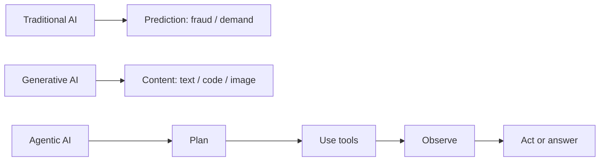

# Artificial Intelligence (AI), Large Language Models (LLMs), and Prompting

## Three AI styles

| Style | Primary job | Example |
| --- | --- | --- |
| Traditional / predictive AI | Classify, predict, or score from learned patterns | Fraud score, demand forecast, spam classifier |
| Generative AI | Create text, code, images, or summaries | Draft an email or summarize an invoice |
| Agentic AI | Use an LLM plus tools and workflow logic to complete a goal | Check inventory, create a purchase order, report the result |

**Interview answer:** Traditional AI predicts a known output; Generative AI creates new content; Agentic AI combines generation with planning, tools, state, and actions. Not every chatbot is agentic—tool use and a controlled multi-step workflow make it agentic.



## Message roles

| Role | Purpose | Safe example |
| --- | --- | --- |
| System message | Defines durable behavior, boundaries, and response style | “Use citations. Do not expose private data.” |
| User message | States the user’s current task | “Summarize this report.” |
| Assistant message | Prior model response / conversation history | Earlier answer or tool-call result |
| Tool message | Structured result returned by application code | `{ "stock": 127 }` |

The system instruction sets policy; the user supplies the task. In a secure application, untrusted document text must never override system rules.

## Reasoning and prompting

**Chain-of-thought (CoT)** is the idea of breaking a difficult problem into intermediate reasoning steps. In production, ask for a concise answer, structured rationale, checks, or tool results—not hidden private reasoning traces.

| Prompt pattern | Best use | Example instruction |
| --- | --- | --- |
| Zero-shot | Simple, well-defined task | “Classify this ticket as billing, support, or sales.” |
| Few-shot | Format or behavior needs examples | “Follow these three input/output examples.” |
| Role / persona | Tone and expertise | “Act as a finance analyst.” |
| Structured output | Reliable machine consumption | “Return JavaScript Object Notation (JSON) matching this schema.” |
| Retrieval-grounded | Private / changing knowledge | “Answer only from supplied context and cite sources.” |
| Decomposition | Complex task | “First identify constraints, then produce a plan.” |

**Prompt engineering vs fine-tuning:** prompt engineering changes instructions and examples at inference time; fine-tuning changes model weights using a training dataset. Start with prompt + Retrieval-Augmented Generation (RAG). Fine-tune when a stable, repeated behavior or style cannot be achieved reliably with prompting and examples.

## Fine-tuning: types, trade-offs, and best practices

Fine-tuning adapts an existing model using examples of the behavior you want. It is best for **repeated behavior**, not for facts that change daily.

| Type | What it teaches | Advantages | Drawbacks | Easy example |
| --- | --- | --- | --- | --- |
| Supervised Fine-Tuning (SFT) | Input → ideal output examples | Direct and easy to evaluate | Needs clean labelled examples | Train invoice text → valid JSON fields |
| Instruction fine-tuning | Improves instruction-following across tasks | Better general task behavior | Can be broad and expensive | “Classify, summarize, or extract as instructed” |
| Domain-adaptive training | Domain language and patterns | Helps with specialized terminology | Does not guarantee current facts | Legal or medical writing style |
| Full fine-tuning | Updates most/all model weights | Maximum adaptation | High GPU cost; risk of forgetting base skills | Large enterprise model program |
| Parameter-Efficient Fine-Tuning (PEFT) | Updates a small set of parameters | Lower cost and faster experiments | May have lower ceiling than full tuning | Customize a local open-source model |
| Low-Rank Adaptation (LoRA) | Trains small low-rank adapter layers | Popular, efficient, reusable adapters | Still needs quality data and evaluation | One adapter for support tone |
| Quantized LoRA (QLoRA) | LoRA with a compressed base model | Uses less GPU memory | Quantization setup is more complex | Fine-tune a larger local model on one GPU |
| Preference tuning / Direct Preference Optimization (DPO) | Learns preferred answer over rejected answer | Good for tone, helpfulness, and style | Preference labels can be subjective | Prefer concise safe answers |
| Reinforcement Learning from Human Feedback (RLHF) | Uses human preferences to steer behavior | Strong alignment method | Complex and costly to run | Improve helpfulness and safety |

### Real-life analogy

```text
Prompt engineering  = giving a new employee better instructions today
RAG                 = giving the employee the latest company handbook
Fine-tuning         = training the employee for weeks with ideal examples
```

### When to choose each option

| Need | Best first choice |
| --- | --- |
| Latest policy, inventory, order, or private document | RAG or tool/API call |
| One small output-format change | Prompt + JSON schema |
| Repeated extraction/classification format | SFT |
| Consistent brand voice or preferred answer style | SFT or DPO |
| Large local model with limited GPU | LoRA or QLoRA |
| New factual knowledge that changes regularly | Do **not** fine-tune; use RAG |

### Fine-tuning best practices

1. Define one measurable goal, such as “extract invoice fields as valid JSON.”
2. Start with prompting, RAG, and a baseline evaluation before training.
3. Use high-quality examples; remove duplicates, conflicting styles, wrong labels, and sensitive data.
4. Match the production message format in training examples.
5. Split data into training, validation, and held-out test sets.
6. Build a golden evaluation set containing normal, edge, unsafe, and abstention cases.
7. Measure correctness, safety, latency, cost, and output-format validity.
8. Version the dataset, base model, fine-tuning configuration, prompt, and evaluation results.

### Interview answer

> Fine-tuning changes a base model’s behavior using task-specific examples. I use Supervised Fine-Tuning for consistent formats such as extraction or classification, and preference tuning for response style. For local models, LoRA or QLoRA reduce GPU cost by training small adapters. I do not use fine-tuning for changing company knowledge; I use RAG or tools. Before training, I create a clean dataset and a separate golden evaluation set to measure quality and safety.

## Model families

| Family | Input → output | Strong use | Familiar real-life examples |
| --- | --- | --- | --- |
| Encoder-only | Text → representations / labels | Search embeddings, classification, Named Entity Recognition (NER) | Bidirectional Encoder Representations from Transformers (BERT)-style models; Google Search-style semantic matching; sentence-transformer embedding models |
| Decoder-only | Previous tokens → next token | Chat, generation, coding | ChatGPT, Claude, Gemini, GitHub Copilot (chat and code-generation use cases) |
| Encoder-decoder | Input sequence → output sequence | Translation, summarization, transformation | Google Translate-style translation; Text-to-Text Transfer Transformer (T5), Bidirectional and Auto-Regressive Transformers (BART), and Fine-tuned Language Net T5 (FLAN-T5) models; document summarization systems |

> **Important interview note:** ChatGPT, Claude, and Gemini are product applications, not one fixed architecture label forever. They are commonly discussed as decoder-style generative assistants, while the product may also use separate embedding, safety, retrieval, vision, or routing models behind the scenes.

## Routing and distillation

**Prompt routing** selects the best model, prompt, tool, or workflow based on intent, complexity, cost, language, or risk. Example: send Frequently Asked Questions (FAQ) to RAG, complex analysis to a stronger model, and transactional requests to an agent workflow.

**LLM distillation** trains a smaller “student” model to imitate useful behavior from a larger “teacher” model. It can reduce cost and latency, but it may lose capability; evaluate carefully on representative data.
