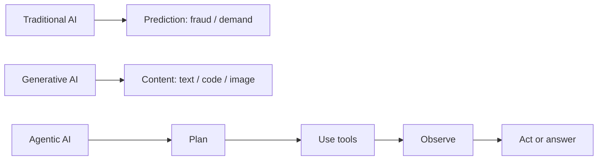

# AI, LLMs, and Prompting

## Three AI styles

| Style | Primary job | Example |
| --- | --- | --- |
| Traditional / predictive AI | Classify, predict, or score from learned patterns | Fraud score, demand forecast, spam classifier |
| Generative AI | Create text, code, images, or summaries | Draft an email or summarize an invoice |
| Agentic AI | Use an LLM plus tools and workflow logic to complete a goal | Check inventory, create a purchase order, report the result |

**Interview answer:** Traditional AI predicts a known output; Generative AI creates new content; Agentic AI combines generation with planning, tools, state, and actions. Not every chatbot is agentic—tool use and a controlled multi-step workflow make it agentic.

## Message roles

| Role | Purpose | Safe example |
| --- | --- | --- |
| System message | Defines durable behavior, boundaries, and response style | “Use citations. Do not expose private data.” |
| User message | States the user’s current task | “Summarize this report.” |
| Assistant message | Prior model response / conversation history | Earlier answer or tool-call result |
| Tool message | Structured result returned by application code | `{ "stock": 127 }` |

The system instruction sets policy; the user supplies the task. In a secure application, untrusted document text must never override system rules.

## Reasoning and prompting

**Chain-of-thought (CoT)** is the idea of breaking a difficult problem into intermediate reasoning steps. In production, ask for a concise answer, structured rationale, checks, or tool results—not hidden private reasoning traces.

| Prompt pattern | Best use | Example instruction |
| --- | --- | --- |
| Zero-shot | Simple, well-defined task | “Classify this ticket as billing, support, or sales.” |
| Few-shot | Format or behavior needs examples | “Follow these three input/output examples.” |
| Role / persona | Tone and expertise | “Act as a finance analyst.” |
| Structured output | Reliable machine consumption | “Return JSON matching this schema.” |
| Retrieval-grounded | Private / changing knowledge | “Answer only from supplied context and cite sources.” |
| Decomposition | Complex task | “First identify constraints, then produce a plan.” |

**Prompt engineering vs fine-tuning:** prompt engineering changes instructions and examples at inference time; fine-tuning changes model weights using a training dataset. Start with prompt + RAG. Fine-tune when a stable, repeated behavior or style cannot be achieved reliably with prompting and examples.

## Model families

| Family | Input / output | Strong use |
| --- | --- | --- |
| Encoder-only | Text → representations / labels | Search embeddings, classification, NER |
| Decoder-only | Previous tokens → next token | Chat, generation, coding |
| Encoder-decoder | Input sequence → output sequence | Translation, summarization, transformation |

## Routing and distillation

**Prompt routing** selects the best model, prompt, tool, or workflow based on intent, complexity, cost, language, or risk. Example: send FAQ questions to RAG, complex analysis to a stronger model, and transactional requests to an agent workflow.

**LLM distillation** trains a smaller “student” model to imitate useful behavior from a larger “teacher” model. It can reduce cost and latency, but it may lose capability; evaluate carefully on representative data.
