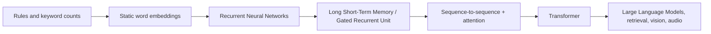
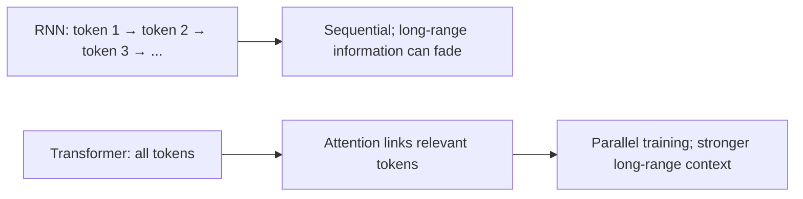
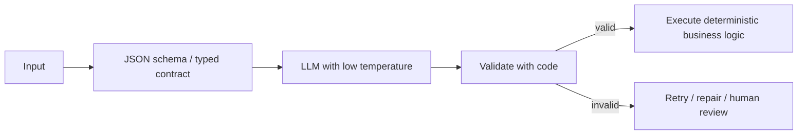

# Transformers, Tokens, and Context

## Easy scenarios to understand quickly

### Scenario 1: Fixed rules versus language understanding

An old support bot might use a fixed rule:

```text
IF customer message contains “refund”
THEN show the refund response
```

This is like an old phone menu: it works only when the customer uses expected words. It may fail for “I want my money back” because the word `refund` is missing. Modern language models can understand that both sentences express the same intent.

### Scenario 2: Keyword search versus meaning search

```text
Customer question: “When can I get my money back?”
Policy document:   “Refund requests are allowed within 30 days.”
```

Keyword search may miss this because the important words differ. An embedding model places both sentences near each other by meaning. Think of a vector database as Google Maps for meaning: it finds nearby meanings, not only the same spelling.

### Scenario 3: Recurrent Neural Network versus Transformer

Imagine 100 people standing in a line. The first person tells a message to the next person, who passes it on:

```text
Person 1 → Person 2 → Person 3 → ... → Person 100
```

This is like a Recurrent Neural Network: it reads one token at a time. Early details can be forgotten, and the process is slow because each person must wait for the previous one.

A Transformer is like putting all 100 people in one meeting. Each person can directly ask the most relevant person for information. This is self-attention.

### Scenario 4: Self-attention in a sentence

```text
“Ravi bought a shirt because he needed it.”
```

The model needs to understand:

```text
“he” → Ravi
“it” → shirt
```

Self-attention lets each token look at other relevant tokens in the same sentence and assign them more importance.

### Scenario 5: Position information

```text
“Dog bites man”
“Man bites dog”
```

The words are the same, but the order changes the meaning. Transformers add positional information to every token, similar to cinema seat numbers. The same people in different seats create a different arrangement.

### Scenario 6: Tokens and context window

A token is a small text piece, like a LEGO block used to build a sentence.

```text
“Hello, how are you?” → [“Hello”, “,”, “ how”, “ are”, “ you”, “?”]
```

The context window is like an employee’s desk. It must hold system instructions, chat history, retrieved documents, the user question, and the answer. If the desk has too many papers, important information can be missed.

### Scenario 7: Lost in the middle

```text
Important company rule
+ 100 pages of unrelated text
+ Important refund evidence
+ User question
```

The model may miss the refund evidence because it is buried in the middle. In a real application, use Retrieval-Augmented Generation to retrieve only relevant chunks, rerank them, summarize old history, and put the best evidence near the question.

## Before Transformers: how language models evolved

Transformers did not appear from nowhere. Earlier Natural Language Processing (NLP) systems handled language with increasingly capable approaches.

| Era / approach | How it worked | Strength | Main limitation | Easy analogy |
| --- | --- | --- | --- | --- |
| Rules and regular expressions | Developers wrote explicit language rules | Predictable for narrow tasks | Breaks on language variation; hard to maintain | A receptionist following a fixed script |
| Bag of Words / Term Frequency–Inverse Document Frequency (TF-IDF) | Counts words and word importance | Fast keyword search and simple classifiers | Loses word order and deep meaning | A book index that only counts words |
| Word embeddings | Maps each word to a numeric meaning vector | Captures basic word similarity | Same word has one meaning in every sentence | “Bank” has one map location for both river bank and money bank |
| Recurrent Neural Network (RNN) | Reads one token at a time and carries a hidden state | Handles sequence order | Slow sequential training; forgets distant information | Pass one note through a long line of people |
| Long Short-Term Memory (LSTM) / Gated Recurrent Unit (GRU) | Improved RNNs with gates that decide what to remember | Better long-term memory than basic RNNs | Still sequential and difficult for very long contexts | A better notebook carried through the same line |
| Sequence-to-sequence with attention | Encoder reads input; decoder generates output while looking back at source tokens | Major improvement for translation | Encoder/decoder recurrence still limits parallelism | Translator rereads important source words while speaking |

### What did Transformers replace?

Transformers mainly replaced **recurrent sequence processing** as the dominant approach for many language tasks. They did not make every older method useless:

- Term Frequency–Inverse Document Frequency (TF-IDF) and keyword search are still valuable for exact identifiers, codes, and product names.
- Long Short-Term Memory (LSTM) and Gated Recurrent Unit (GRU) models can still be useful on small, streaming, or constrained-device workloads.
- Transformers became the standard foundation for modern large-scale language, vision, audio, and multimodal models.



## Why Transformers changed the field

| Transformer capability | What is new compared with recurrent models | Production benefit |
| --- | --- | --- |
| Global attention | A token can directly attend to relevant distant tokens | Better references, long documents, and code understanding |
| Parallel training | All input tokens can be processed together during training | Faster training on Graphics Processing Units (GPUs) and large datasets |
| Pretraining then adaptation | Learn broad language patterns before task-specific work | One base model can be prompted, fine-tuned, or used for Retrieval-Augmented Generation (RAG) |
| Scaling | Architecture works well with more data, parameters, and compute | Enables modern Large Language Models (LLMs) |
| Transfer across modalities | Same attention idea can work on text, images, audio, and more | Supports multimodal assistants |

### Important trade-offs

Transformers are powerful, but standard attention can become expensive as input length grows because many token pairs are compared. They also require large amounts of data and compute for frontier-scale training, can hallucinate, and still need RAG, tools, guardrails, and evaluation for reliable production use.

### Interview-ready answer

> Before Transformers, Natural Language Processing used rules, keyword methods, static embeddings, Recurrent Neural Networks, Long Short-Term Memory networks, and sequence-to-sequence models. These approaches either lost context or processed language sequentially. Transformers use self-attention to connect relevant tokens directly and enable parallel training, which made large-scale pretraining possible. They are powerful but can be expensive for long contexts, so in production I combine them with retrieval, context management, validation, and evaluation.

## Why transformers were needed

A Recurrent Neural Network (RNN) reads a sequence one step at a time and carries a hidden state forward. Long sequences make it hard to preserve early information, and sequential computation limits parallelism. Transformers use attention to connect tokens directly and train in parallel.



## Transformer building blocks

1. **Tokenization:** turns text into model-readable token IDs; tokens may be words, subwords, or punctuation.
2. **Token embeddings:** map token IDs to vectors.
3. **Positional information:** tells the model token order because attention alone is order-independent.
4. **Attention blocks:** decide which tokens matter to each token.
5. **Feed-forward layers and residual connections:** transform and preserve information.
6. **Output head:** predicts a class, vector, or next token.

## Attention types

| Type | What attends to what | Example |
| --- | --- | --- |
| Self-attention | Tokens within the same sequence | In “The cat sat because it was tired,” link “it” to “cat.” |
| Cross-attention | One sequence attends to another | Decoder attends to source text in translation. |
| Causal / masked attention | Each token sees only earlier tokens | Prevents a chat model from seeing future generated text. |

**How order works:** position embeddings or positional encodings are added to token embeddings before attention. Modern models may use relative/rotary position methods rather than a simple fixed index.

## Transformer choices: benefits, limits, and examples

| Topic | Advantages | Limitations / drawbacks | Real-life example |
| --- | --- | --- | --- |
| Self-attention | Connects distant relevant words | Attention cost grows quickly with long input | Link “it” to the correct product in a long complaint |
| Encoder-only model | Strong embeddings and classification | Does not naturally generate long text | Search similar support tickets |
| Decoder-only model | Strong chat, code, and generation | Can hallucinate; output is probabilistic | Customer-support assistant reply |
| Encoder-decoder model | Good input-to-output transformation | More architecture components | Translate an invoice summary |
| Long context | Can read more material at once | Higher cost, latency, and lost-in-the-middle risk | Review a long contract |

**Best practice:** never assume a large context window means the model will use every page well. Retrieve, filter, and order evidence deliberately.

## Context overload and “lost in the middle”

Every model has a context window. Too much context raises cost, latency, and confusion. “Lost in the middle” describes a common pattern where models use information near the beginning or end more reliably than equally relevant information buried in the middle.

Mitigations:

- Retrieve only high-quality chunks; do not paste entire documents.
- Put the most relevant evidence near the question or use a clear evidence structure.
- Rerank, compress, or summarize long histories.
- Keep tool outputs structured and short.
- Use staged retrieval: retrieve → refine query → retrieve again when needed.

## Deterministic LLM programming

LLMs are probabilistic, so make the surrounding system deterministic where correctness matters:



Use JavaScript Object Notation (JSON) structured outputs, tool schemas, validators, idempotency keys, permission checks, test cases, and low temperature. Never rely on a Large Language Model (LLM) alone for money movement, authorization, or irreversible actions.
