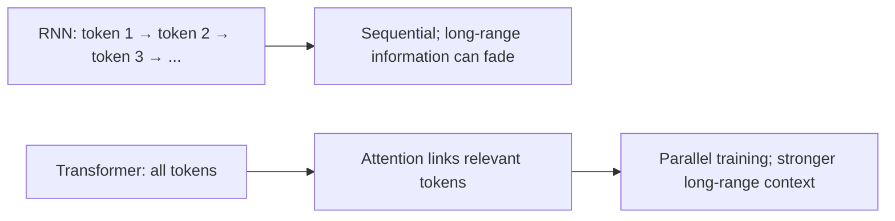
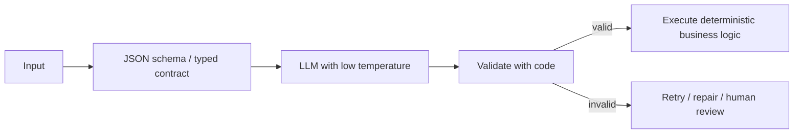

# Transformers, Tokens, and Context

## Why transformers were needed

A Recurrent Neural Network (RNN) reads a sequence one step at a time and carries a hidden state forward. Long sequences make it hard to preserve early information, and sequential computation limits parallelism. Transformers use attention to connect tokens directly and train in parallel.

## Transformer building blocks

1. **Tokenization:** turns text into model-readable token IDs; tokens may be words, subwords, or punctuation.
2. **Token embeddings:** map token IDs to vectors.
3. **Positional information:** tells the model token order because attention alone is order-independent.
4. **Attention blocks:** decide which tokens matter to each token.
5. **Feed-forward layers and residual connections:** transform and preserve information.
6. **Output head:** predicts a class, vector, or next token.

## Attention types

| Type | What attends to what | Example |
| --- | --- | --- |
| Self-attention | Tokens within the same sequence | In “The cat sat because it was tired,” link “it” to “cat.” |
| Cross-attention | One sequence attends to another | Decoder attends to source text in translation. |
| Causal / masked attention | Each token sees only earlier tokens | Prevents a chat model from seeing future generated text. |

**How order works:** position embeddings or positional encodings are added to token embeddings before attention. Modern models may use relative/rotary position methods rather than a simple fixed index.

## Transformer choices: benefits, limits, and examples

| Topic | Advantages | Limitations / drawbacks | Real-life example |
| --- | --- | --- | --- |
| Self-attention | Connects distant relevant words | Attention cost grows quickly with long input | Link “it” to the correct product in a long complaint |
| Encoder-only model | Strong embeddings and classification | Does not naturally generate long text | Search similar support tickets |
| Decoder-only model | Strong chat, code, and generation | Can hallucinate; output is probabilistic | Customer-support assistant reply |
| Encoder-decoder model | Good input-to-output transformation | More architecture components | Translate an invoice summary |
| Long context | Can read more material at once | Higher cost, latency, and lost-in-the-middle risk | Review a long contract |

**Best practice:** never assume a large context window means the model will use every page well. Retrieve, filter, and order evidence deliberately.

## Context overload and “lost in the middle”

Every model has a context window. Too much context raises cost, latency, and confusion. “Lost in the middle” describes a common pattern where models use information near the beginning or end more reliably than equally relevant information buried in the middle.

Mitigations:

- Retrieve only high-quality chunks; do not paste entire documents.
- Put the most relevant evidence near the question or use a clear evidence structure.
- Rerank, compress, or summarize long histories.
- Keep tool outputs structured and short.
- Use staged retrieval: retrieve → refine query → retrieve again when needed.

## Deterministic LLM programming

LLMs are probabilistic, so make the surrounding system deterministic where correctness matters:

Use JavaScript Object Notation (JSON) structured outputs, tool schemas, validators, idempotency keys, permission checks, test cases, and low temperature. Never rely on a Large Language Model (LLM) alone for money movement, authorization, or irreversible actions.
