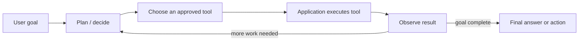
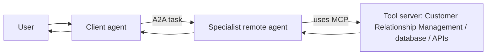
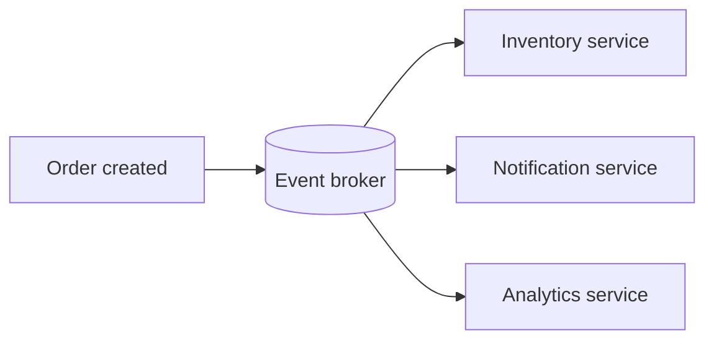

# Agents, Frameworks, and Protocols

## What is an AI agent?

An Artificial Intelligence (AI) agent is an application that uses a Large Language Model (LLM) as one part of a controlled workflow. It receives a goal, decides the next useful step, uses approved tools, observes the result, and either continues or returns a final answer.



### Easy real-life scenario: restaurant manager

```text
Customer: “I want to order 20 blue shirts for next Friday.”
        ↓
Manager understands the request
        ↓
Checks stock → checks supplier → calculates delivery date
        ↓
Asks for approval if payment is required
        ↓
Creates the order → confirms it to the customer
```

The manager is like an agent. The warehouse system, supplier system, and payment system are tools. The agent does not directly access databases; the application executes approved tool calls and returns results.

### Agent versus chatbot

| Capability | Conversational chatbot | Controlled AI agent |
| --- | --- | --- |
| Main job | Answer questions | Complete a goal |
| Tools | Optional | Usually required |
| Multi-step actions | Usually no | Yes, with workflow controls |
| Example | “Our refund policy is 30 days.” | Check order, create refund request, report status |

**Interview-ready answer:**

> An AI agent is an LLM-powered workflow that can reason about a goal, select approved tools, receive tool results, and continue through multiple steps. I keep tool execution, permissions, validation, and business rules in the application, not inside the model.

## Agent memory

| Memory type | Lifetime | Example |
| --- | --- | --- |
| Working / short-term | Current conversation or task | Recent messages and current plan |
| Long-term | Across sessions | User preferences, approved facts, past outcomes |
| Semantic memory | Retrieved knowledge | Policy passages from a vector database (DB) |
| Episodic memory | Past events / traces | “The user previously approved this supplier” |

Store memory deliberately. Keep only data that is useful, permitted, and auditable; use retrieval rather than placing every old message into the prompt.

### Easy memory scenario: a hotel receptionist

| Memory type | Hotel analogy | AI example |
| --- | --- | --- |
| Working / short-term | What you asked during this check-in | Current conversation, selected product, current plan |
| Long-term | You prefer a non-smoking room on future visits | Stored user preference, if consented and allowed |
| Semantic | The receptionist checks the hotel policy book | Retrieve company policy from a vector database |
| Episodic | “You stayed last month and reported a broken light” | A past ticket, tool trace, or completed workflow outcome |

### Memory best practices

1. Store only data with a clear business purpose and user permission.
2. Keep sensitive data separate and apply access controls before retrieval.
3. Summarize old conversations instead of sending every message again.
4. Save important facts with a source, timestamp, and expiry rule.
5. Let users correct or remove personal memory when required.

### Agent patterns and trade-offs

| Pattern | Advantage | Drawback | Real-life example |
| --- | --- | --- | --- |
| Single tool-using agent | Simple architecture | Can become unreliable for complex work | Support bot checks one order Application Programming Interface (API) |
| Router + specialist workflows | Clear separation of responsibilities | More routing and observability work | Send billing, catalog, and analytics requests to different flows |
| Multi-agent delegation | Useful for independent specialist tasks | More latency, cost, and coordination failures | Research agent delegates data analysis to an analyst agent |
| Human-in-the-loop | Safer for high-impact actions | Slower experience | Manager approves a purchase order before submission |

**Best practice:** begin with a deterministic workflow and a small tool set. Add autonomous planning or multiple agents only when a measurable need exists.

### Tool calling in practice

```text
User: “Where is order 123?”
        ↓
LLM selects: get_order_status(order_id="123")
        ↓
Backend validates the user and order ID
        ↓
Backend calls the order service
        ↓
Tool result: {"status": "shipped", "estimated_delivery": "Friday"}
        ↓
LLM: “Order 123 has shipped and is expected on Friday.”
```

The LLM selects a tool schema; backend code validates arguments, permissions, and results. This prevents the LLM from directly gaining database authority.

## LangChain and LangGraph

| Tool | Role |
| --- | --- |
| LangChain | High-level components and integrations for models, prompts, retrievers, tools, and common agent loops |
| LangGraph | Low-level stateful orchestration for durable, long-running workflows, checkpoints, branches, human approval, and cycles |

Use LangChain for a straightforward assistant. Use LangGraph when the process needs explicit state, retries, routing, pause/resume, or human-in-the-loop control. LangGraph can be used without LangChain. [Official overview](https://docs.langchain.com/oss/python/langgraph/overview)

### Easy framework scenario: a delivery workflow

| Need | Best fit | Restaurant analogy |
| --- | --- | --- |
| Prompt + model + one retrieval/tool call | LangChain | A cashier takes one order and asks the kitchen once |
| Branches, retries, approvals, and saved state | LangGraph | A kitchen workflow: check ingredients → cook → quality check → retry or ask manager approval |

**Advantages of LangChain:** fast integrations and less boilerplate. **Drawback:** complex agent processes can become hard to inspect if their state and branching are implicit.

**Advantages of LangGraph:** explicit state, durable execution, checkpoints, and human approval. **Drawback:** more workflow design and engineering work than a simple chat application.

## MCP and A2A

| Protocol | Main connection | Mental model |
| --- | --- | --- |
| MCP (Model Context Protocol) | An AI application / agent to external tools, resources, and prompts | “How my agent uses a database, filesystem, or Software as a Service (SaaS) tool” |
| A2A (Agent2Agent Protocol) | One autonomous agent to another remote agent | “How my travel agent delegates a task to a specialist agent” |

**MCP components:** host (the AI application), client (connection inside the host), server (tool/resource provider), tools (actions), resources (readable context), and prompts (reusable templates).

**A2A components:** user, A2A client agent, remote A2A server/agent, Agent Card (capabilities and endpoint), tasks, messages, parts/artifacts, and authentication. A2A treats the remote agent as opaque: the client need not know its internal tools or memory. [A2A key concepts](https://a2a-protocol.org/v0.2.6/topics/key-concepts/)

### Easy protocol scenario: office building

```text
Model Context Protocol (MCP)
Your employee uses standard office services:
calendar, customer system, files, and database tools.

Agent2Agent Protocol (A2A)
Your employee asks another specialist employee to do a complete task:
“Travel agent, find and book the best flight within this budget.”
```

| Protocol | Use it when | Advantage | Drawback |
| --- | --- | --- | --- |
| Model Context Protocol (MCP) | Your application needs a standard connection to a tool/resource provider | Reusable tool integration | You still own tool permissions and safety controls |
| Agent2Agent Protocol (A2A) | One independent agent delegates a complete task to another agent | Supports specialist-agent interoperability | More latency, authentication, task-status, and coordination complexity |



## Event-driven architecture

Instead of one service waiting synchronously for every step, services publish events and interested consumers react.



It improves decoupling and scalability. Use event schemas, idempotent consumers, retries, dead-letter queues, tracing, and an outbox pattern to handle failures safely.

### Easy event-driven scenario: online order

```text
Customer places order
        ↓ publishes “OrderCreated” event
Event broker
   ├── Inventory service reserves stock
   ├── Payment service starts payment processing
   ├── Notification service sends confirmation
   └── Analytics service records the sale
```

This is better than making one service wait for every downstream service. The trade-off is that events may arrive twice or later than expected, so consumers must be **idempotent**: processing the same event twice must not create two payments or two shipments.

### Key event-driven terms

| Term | Simple meaning | Real-life example |
| --- | --- | --- |
| Event broker | System that distributes events | Post office sorting letters to recipients |
| Idempotent consumer | Safe if it receives the same event again | A scanner that marks the same ticket as used only once |
| Retry | Try failed work again after a delay | Call a supplier again if their system is temporarily unavailable |
| Dead-letter queue | Store repeatedly failing events for inspection | A tray for letters with an invalid address |
| Outbox pattern | Save database change and event together, then publish reliably | Record an order and its dispatch note before sending it |

## Final interview answer

> I design agents as controlled workflows, not unrestricted autonomous systems. The LLM interprets the goal and selects from allowlisted tools. The backend validates permissions and arguments, executes the tool, and records traces. I use memory selectively, LangChain for straightforward integrations, LangGraph for stateful workflows, Model Context Protocol for tool connectivity, Agent2Agent Protocol for agent delegation, and event-driven architecture for reliable asynchronous work.
