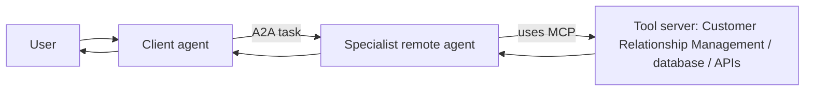
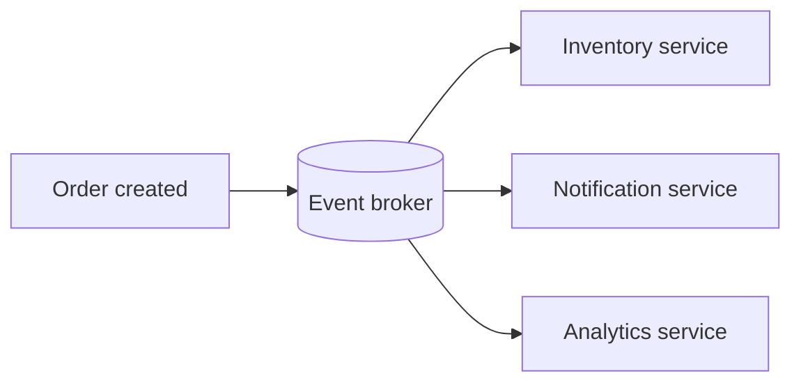

# Agents, Frameworks, and Protocols

## Agent memory

| Memory type | Lifetime | Example |
| --- | --- | --- |
| Working / short-term | Current conversation or task | Recent messages and current plan |
| Long-term | Across sessions | User preferences, approved facts, past outcomes |
| Semantic memory | Retrieved knowledge | Policy passages from a vector database (DB) |
| Episodic memory | Past events / traces | “The user previously approved this supplier” |

Store memory deliberately. Keep only data that is useful, permitted, and auditable; use retrieval rather than placing every old message into the prompt.

## LangChain and LangGraph

| Tool | Role |
| --- | --- |
| LangChain | High-level components and integrations for models, prompts, retrievers, tools, and common agent loops |
| LangGraph | Low-level stateful orchestration for durable, long-running workflows, checkpoints, branches, human approval, and cycles |

Use LangChain for a straightforward assistant. Use LangGraph when the process needs explicit state, retries, routing, pause/resume, or human-in-the-loop control. LangGraph can be used without LangChain. [Official overview](https://docs.langchain.com/oss/python/langgraph/overview)

## MCP and A2A

| Protocol | Main connection | Mental model |
| --- | --- | --- |
| MCP (Model Context Protocol) | An AI application / agent to external tools, resources, and prompts | “How my agent uses a database, filesystem, or Software as a Service (SaaS) tool” |
| A2A (Agent2Agent Protocol) | One autonomous agent to another remote agent | “How my travel agent delegates a task to a specialist agent” |

**MCP components:** host (the AI application), client (connection inside the host), server (tool/resource provider), tools (actions), resources (readable context), and prompts (reusable templates).

**A2A components:** user, A2A client agent, remote A2A server/agent, Agent Card (capabilities and endpoint), tasks, messages, parts/artifacts, and authentication. A2A treats the remote agent as opaque: the client need not know its internal tools or memory. [A2A key concepts](https://a2a-protocol.org/v0.2.6/topics/key-concepts/)

## Event-driven architecture

Instead of one service waiting synchronously for every step, services publish events and interested consumers react.

It improves decoupling and scalability. Use event schemas, idempotent consumers, retries, dead-letter queues, tracing, and an outbox pattern to handle failures safely.
