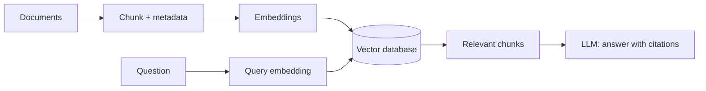

# Retrieval-Augmented Generation (RAG) and Retrieval Systems

## RAG in one minute

Retrieval-Augmented Generation retrieves relevant private or current evidence before asking an LLM to answer. It is preferred over fine-tuning when knowledge changes frequently or answers need citations.



## Chunking

A chunk is a retrievable document unit. Start with 300–800 tokens and 50–150 token overlap, then evaluate. Prefer structural boundaries: heading + paragraphs for prose, function/class for code, page + heading for PDFs, and rows plus headings for tables.

Store metadata with every chunk: source, title, page/section, timestamp/version, tenant, and permissions. Chunk size is a retrieval-quality decision, not a universal constant.

## Dense, sparse, and hybrid search

| Search | Good at | Limitation |
| --- | --- | --- |
| Dense / vector | Meaning and paraphrases | Can miss exact IDs or rare terms |
| Sparse / Best Matching 25 (BM25) keyword | Exact names, Stock Keeping Units (SKUs), error codes | Weak at semantic paraphrases |
| Hybrid | Combines both | More tuning and infrastructure |

## Approximate Nearest Neighbor (ANN) and Hierarchical Navigable Small World (HNSW)

Exact nearest-neighbor search compares a query vector with every stored vector—accurate but slow at scale. **ANN** (Approximate Nearest Neighbor) searches an efficient index and accepts a tiny possibility of missing the exact best neighbor for much lower latency.

**HNSW** is a common ANN index. It builds multiple graph layers: upper layers make big jumps across the vector space; lower layers refine the local search. Key trade-offs are memory, build time, recall, and query latency.

## Reranking and HyDE

**Reranking:** retrieve a broad candidate set (for example, 20–50), then use a stronger cross-encoder/reranker to score the query and each candidate together; pass only the best 3–8 chunks to the LLM. Libraries include `sentence-transformers` CrossEncoder, Cohere Rerank, and vendor rerank APIs.

**Hypothetical Document Embeddings (HyDE):** ask a Large Language Model (LLM) to draft a hypothetical answer/document for the question, embed that draft, then retrieve real documents similar to it. It can improve semantic retrieval for vague questions, but real retrieved sources—not the hypothetical text—must be used as evidence.

## A production retrieval recipe

```text
Question → rewrite / route → hybrid retrieve top 30
→ permission filter → rerank top 10 → choose evidence top 5
→ LLM with citation requirement → evaluate and log
```
