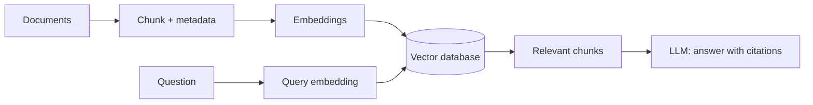

# Retrieval-Augmented Generation (RAG) and Retrieval Systems

## RAG in one minute

Retrieval-Augmented Generation retrieves relevant private or current evidence before asking an LLM to answer. It is preferred over fine-tuning when knowledge changes frequently or answers need citations.



## PostgreSQL with pgvector

I use PostgreSQL as the primary relational database and the `pgvector` extension to store and search embedding vectors. This lets me keep vectors, document text, metadata, tenant information, and access-control fields together while still using normal SQL queries, joins, filters, and transactions.

In a RAG pipeline, I split documents into chunks, generate an embedding for each chunk, and save the embedding in a `vector` column. At query time, I embed the user's question and use a distance operator to retrieve the most similar chunks. I can then apply SQL metadata or permission filters before sending the selected evidence to the LLM.

`pgvector` supports exact similarity search and approximate indexes such as **Hierarchical Navigable Small World (HNSW)** and **Inverted File Flat (IVFFlat)**. HNSW generally provides strong query performance and recall but uses more memory and takes longer to build. IVFFlat is lighter, but it requires representative data and tuning. This setup is a practical choice when an application already uses PostgreSQL and does not yet need a separate vector database.

### Interview question: Why did you choose pgvector?

I chose `pgvector` because the application already uses PostgreSQL. It lets me add semantic search without operating another database, and I can combine vector similarity with relational filters, permissions, and transactions in one query. For large-scale or highly specialized vector workloads, I would benchmark it against a dedicated vector database before deciding.

## Chunking

A chunk is a retrievable document unit. Start with 300–800 tokens and 50–150 token overlap, then evaluate. Prefer structural boundaries: heading + paragraphs for prose, function/class for code, page + heading for PDFs, and rows plus headings for tables.

Store metadata with every chunk: source, title, page/section, timestamp/version, tenant, and permissions. Chunk size is a retrieval-quality decision, not a universal constant.

### Chunking choices: benefits and drawbacks

| Strategy | Advantage | Drawback | Real-life example |
| --- | --- | --- | --- |
| Fixed-size with overlap | Simple and reliable baseline | Can split a topic in an unnatural place | Split a policy manual every 500 tokens |
| Paragraph / heading based | Preserves document meaning | Chunk sizes can vary greatly | Keep “Refund policy” heading with its paragraphs |
| Semantic chunking | Groups sentences with similar meaning | More processing and tuning required | Separate shipping rules from refund rules |
| Parent-child chunking | Retrieves small chunks but returns wider context | More storage and implementation work | Find one clause, then return the whole policy section |
| Code-aware chunking | Preserves functions and classes | Requires language-aware parsing | Retrieve the complete `calculate_total()` function |

**Best practice:** start with heading/paragraph boundaries and a small overlap. Build a retrieval evaluation set before changing chunk size, overlap, or strategy.

## Dense, sparse, and hybrid search

| Search | Good at | Limitation |
| --- | --- | --- |
| Dense / vector | Meaning and paraphrases | Can miss exact IDs or rare terms |
| Sparse / Best Matching 25 (BM25) keyword | Exact names, Stock Keeping Units (SKUs), error codes | Weak at semantic paraphrases |
| Hybrid | Combines both | More tuning and infrastructure |

## Approximate Nearest Neighbor (ANN) and Hierarchical Navigable Small World (HNSW)

Exact nearest-neighbor search compares a query vector with every stored vector—accurate but slow at scale. **ANN** (Approximate Nearest Neighbor) searches an efficient index and accepts a tiny possibility of missing the exact best neighbor for much lower latency.

**HNSW** is a common ANN index. It builds multiple graph layers: upper layers make big jumps across the vector space; lower layers refine the local search. Key trade-offs are memory, build time, recall, and query latency.

## Reranking and HyDE

**Reranking:** retrieve a broad candidate set (for example, 20–50), then use a stronger cross-encoder/reranker to score the query and each candidate together; pass only the best 3–8 chunks to the LLM. Libraries include `sentence-transformers` CrossEncoder, Cohere Rerank, and vendor rerank APIs.

**Hypothetical Document Embeddings (HyDE):** ask a Large Language Model (LLM) to draft a hypothetical answer/document for the question, embed that draft, then retrieve real documents similar to it. It can improve semantic retrieval for vague questions, but real retrieved sources—not the hypothetical text—must be used as evidence.

### Retrieval methods: when to use them

| Method | Main advantage | Main drawback | Use it when |
| --- | --- | --- | --- |
| Vector search | Finds similar meaning and paraphrases | May miss exact IDs or codes | User language is conversational |
| Keyword search | Excellent exact matching | Weak semantic understanding | Search has SKUs, names, or error codes |
| Hybrid search | Covers meaning and exact terms | More tuning and operational complexity | Production knowledge search |
| Reranking | Significantly improves final evidence quality | Adds model cost and latency | Initial top-k contains near misses |
| HyDE | Helps vague or abstract questions | Generated hypothetical text can bias search | Semantic recall is weak after basic retrieval |

## A production retrieval recipe

```text
Question → rewrite / route → hybrid retrieve top 30
→ permission filter → rerank top 10 → choose evidence top 5
→ LLM with citation requirement → evaluate and log
```
