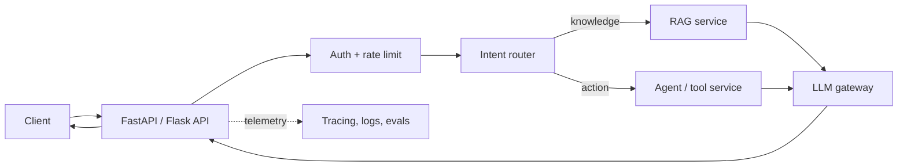

# Backend and System Design for AI Applications

## REST APIs

REST is an architectural style for HTTP APIs built around resources. Typical operations use `GET` to read, `POST` to create, `PUT/PATCH` to update, and `DELETE` to remove. A good REST API uses clear resource URLs, status codes, authentication, validation, pagination, idempotency where needed, and versioning when contracts change.

## Flask vs FastAPI

| Topic | Flask | FastAPI |
| --- | --- | --- |
| Style | Lightweight, flexible microframework | Modern API framework with type hints |
| Validation/docs | Add extensions manually | Pydantic validation and OpenAPI docs built in |
| Async | Supported, but not its original core focus | Designed for async-friendly API work |
| Best fit | Simple services or existing Flask ecosystem | Typed APIs, validation-heavy services, async I/O |

FastAPI is often convenient for AI APIs because requests frequently wait on model, vector DB, or external tool I/O. Framework choice does not make a system scalable by itself—database, model latency, queueing, caching, observability, and deployment matter too.

## Database optimization

1. Measure slow queries first using query plans and production-like data.
2. Add indexes for frequent filters, joins, and sort keys; avoid unnecessary indexes because writes become slower.
3. Select only required columns, paginate large results, and avoid N+1 queries.
4. Use connection pooling, caching, and read replicas when justified.
5. Partition/archive very large tables only after measuring.
6. For RAG, separately tune chunk strategy, metadata filters, vector index parameters, and reranking.

## AI service HLD

## Interview system-design close

> I separate the LLM from business authority. The API authenticates the user, routes the request, retrieves only permitted context or invokes allowlisted tools, validates the model output, and records traces and evaluations. This design makes the system safer, testable, and easier to evolve.
