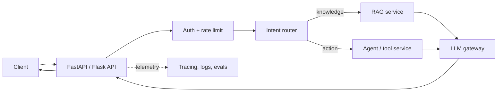

# Backend and System Design for Artificial Intelligence (AI) Applications

## Representational State Transfer (REST) Application Programming Interfaces (APIs)

REST is an architectural style for Hypertext Transfer Protocol (HTTP) APIs built around resources. Typical operations use `GET` to read, `POST` to create, `PUT/PATCH` to update, and `DELETE` to remove. A good REST API uses clear resource URLs, status codes, authentication, validation, pagination, idempotency where needed, and versioning when contracts change.

## Flask vs FastAPI

| Topic | Flask | FastAPI |
| --- | --- | --- |
| Style | Lightweight, flexible microframework | Modern API framework with type hints |
| Validation/docs | Add extensions manually | Pydantic validation and OpenAPI docs built in |
| Async | Supported, but not its original core focus | Designed for async-friendly API work |
| Best fit | Simple services or existing Flask ecosystem | Typed APIs, validation-heavy services, async I/O |

FastAPI is often convenient for AI APIs because requests frequently wait on model, vector database (DB), or external tool Input / Output (I/O). Framework choice does not make a system scalable by itself—database, model latency, queueing, caching, observability, and deployment matter too.

### API styles: advantages and drawbacks

| Style | Advantage | Drawback | Real-life example |
| --- | --- | --- | --- |
| REST API | Simple, resource-oriented, widely understood | Multiple requests can be needed for related data | `GET /orders/123` returns an order |
| GraphQL | Client requests exactly the data it needs | More complex schema/security design | Dashboard asks for order, customer, and items in one query |
| gRPC | Fast typed service-to-service calls | Less browser-friendly and harder to inspect manually | Internal inventory service calls |
| Webhooks / events | Decoupled asynchronous processing | Requires idempotency and failure handling | `OrderCreated` triggers inventory and notifications |

**Best practice:** use REST for clear external resource APIs, asynchronous events for long-running or decoupled work, and queues/workers for tasks that should not block a user request.

## Database optimization

1. Measure slow queries first using query plans and production-like data.
2. Add indexes for frequent filters, joins, and sort keys; avoid unnecessary indexes because writes become slower.
3. Select only required columns, paginate large results, and avoid N+1 queries.
4. Use connection pooling, caching, and read replicas when justified.
5. Partition/archive very large tables only after measuring.
6. For RAG, separately tune chunk strategy, metadata filters, vector index parameters, and reranking.

### Database optimization: benefit and risk

| Technique | Benefit | Risk / drawback | Example |
| --- | --- | --- | --- |
| Index | Faster reads for common filters | Extra storage and slower writes | Index `order_id` for order lookup |
| Cache | Low latency for repeated reads | Stale data and invalidation complexity | Cache product catalog for five minutes |
| Connection pool | Reuses expensive database connections | Bad pool settings can exhaust the database | API workers share a controlled pool |
| Read replica | Scales read-heavy workloads | Replication delay | Reports read from replica; payments use primary |
| Partitioning | Improves very large-table operations | More operational complexity | Partition logs by month |

## AI service High-Level Design (HLD)

## Interview system-design close

> I separate the LLM from business authority. The API authenticates the user, routes the request, retrieves only permitted context or invokes allowlisted tools, validates the model output, and records traces and evaluations. This design makes the system safer, testable, and easier to evolve.
