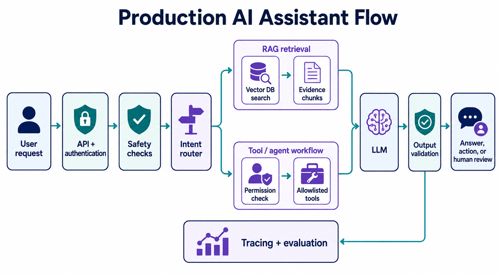
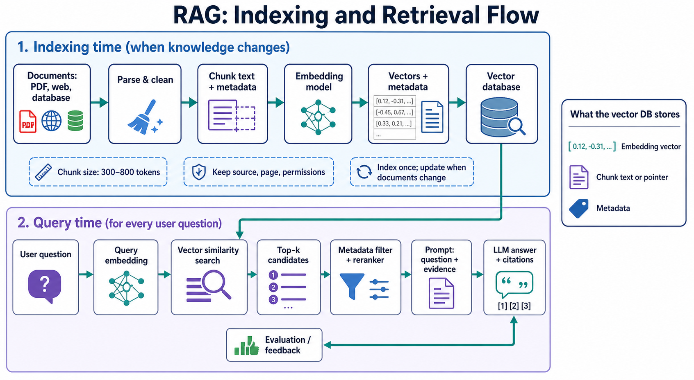

# AI Interview Questions and Answers

## AI fundamentals

### What is the difference between traditional AI, Generative AI, and Agentic AI?

Traditional AI predicts or classifies a known output, such as fraud/not-fraud. Generative AI creates new content, such as a summary or code. Agentic AI adds planning, tool use, state, and controlled actions so a system can complete a multi-step goal. An agent still uses a generative model; it is the surrounding workflow that makes it agentic.

### What are system and user messages?

A system message sets durable rules, safety boundaries, and output style. A user message contains the current request. Tool messages contain data returned by the application. The system message has higher priority, but it is not a security boundary by itself—permissions and tool validation must be enforced in code.

### What is chain-of-thought?

Chain-of-thought is the approach of using intermediate reasoning steps for difficult tasks. In an application, prefer concise explanations, structured plans, tool outputs, and verifiable checks rather than relying on private hidden reasoning. The important engineering goal is reliable results, not exposing every internal reasoning token.

### What prompting approaches should I know?

Zero-shot gives only an instruction. Few-shot includes examples. Role prompting sets expertise or tone. Structured-output prompting requests JSON against a schema. Retrieval-grounded prompting supplies trusted evidence. Decomposition splits a difficult task into smaller stages. Choose the simplest approach that reliably meets the requirement.

### How does prompt engineering differ from fine-tuning?

Prompt engineering changes instructions, examples, and context at runtime. Fine-tuning changes model weights using training data. Start with a strong prompt and RAG because they are fast to iterate and keep knowledge current. Fine-tune for stable, repeated behavior or style that prompting cannot achieve consistently.

## Models and transformers

### What are encoder, decoder, and encoder-decoder models?

Encoder-only models turn text into useful representations and are strong for embeddings, classification, and search. Decoder-only models predict the next token and are strong for chat, code, and generation. Encoder-decoder models read an input sequence and generate an output sequence, which suits translation and summarization.

### What problem does a transformer solve compared with an RNN?

An RNN processes tokens one by one, so it is difficult to parallelize and long-range information can weaken over many steps. A transformer uses attention so each token can directly weigh relevant tokens, enabling parallel training and stronger handling of long relationships.

### What are self-attention and cross-attention?

Self-attention connects tokens within the same sequence; for example, it can link “it” to “the cat.” Cross-attention connects one sequence to another, such as a decoder attending to the source text during translation. Decoder-only LLMs use causal masking so a token cannot see future tokens.

### If transformers process tokens in parallel, how do they know word order?

They add positional information to token embeddings before attention. This can be learned position embeddings or relative/rotary position methods. Without position information, “dog bites man” and “man bites dog” would look like the same unordered token set.

### What is tokenization?

Tokenization splits text into IDs the model can process. A token is not always a full word; it may be a word piece, punctuation, or code fragment. Context-window usage and API cost are measured in tokens, so long prompts, retrieved chunks, and chat history must be managed carefully.

### How do you handle context overload and the “lost in the middle” effect?

Retrieve only the most relevant chunks, rerank them, preserve source metadata, and put critical evidence near the question. Summarize old conversation history, use structured tool outputs, and stage complex retrieval. “Lost in the middle” means important evidence in the center of a long prompt may receive less attention than evidence near the beginning or end.

## Production AI flow

### How do you make LLM behavior more deterministic?

Use a low temperature, JSON schemas, typed tool contracts, code validation, permission checks, idempotency keys, retries, and human approval for high-impact actions. The LLM can decide or draft, but deterministic code must validate and execute business rules.

### What is prompt routing?

Prompt routing selects the best model, prompt, tool, or workflow based on intent, complexity, cost, language, or risk. For example, route a policy question to RAG, a transaction request to an allowlisted tool workflow, and a complex analysis request to a stronger model.

### What is LLM distillation?

Distillation trains a smaller student model to imitate useful behavior from a larger teacher model. It can lower cost and latency but may lose capability, so compare it against the teacher using a representative evaluation set.

## Agent systems and frameworks

### How is memory implemented in an agentic system?

Use short-term memory for the current task, long-term memory for approved user preferences, semantic memory through retrieval from documents, and episodic memory through past traces or outcomes. Store only useful, authorized data and retrieve it on demand instead of adding every past conversation to the prompt.

### What are LangChain and LangGraph used for?

LangChain provides reusable components and integrations for prompts, models, retrievers, tools, and common agent loops. LangGraph is lower-level orchestration for stateful, long-running processes with branches, checkpoints, retries, cycles, and human approval. Use LangGraph when the workflow must be explicit and durable.

### What are MCP and A2A, and how are they different?

MCP connects an AI application or agent to tools, resources, and reusable prompts—for example, a database or CRM tool server. A2A connects one agent to another remote agent that can work as a specialist. MCP is usually agent-to-capability; A2A is agent-to-agent collaboration.

### What are the core components of A2A?

The main components are a user, a client agent, a remote agent/server, an Agent Card that advertises capabilities and endpoint details, tasks, messages, artifacts, and authentication. The client does not need to know the remote agent’s internal tools or memory.

### What is event-driven architecture?

Services publish events to a broker and other services react independently. For example, an “OrderCreated” event can trigger inventory, notification, and analytics services. Design for idempotent consumers, retries, dead-letter queues, schema versioning, and tracing.

## Safety and evaluation

### What is LLM injection and how do you handle it?

Prompt injection is untrusted content trying to override instructions or trigger unsafe actions. Treat user content and retrieved documents as untrusted. Use role separation, input filtering, least-privilege access, allowlisted tools, server-side permission checks, parameter validation, output scanning, audit logs, and human confirmation for sensitive actions.

### What are LLM guardrails?

Guardrails are layered runtime controls around an LLM: content moderation, PII redaction, prompt-injection detection, retrieval permission filters, tool policies, JSON validation, rate limiting, and output safety checks. They support model alignment but do not replace application security.

### Why do hallucinations happen and how do you reduce them?

LLMs generate likely next tokens, not verified facts. Hallucinations occur with missing evidence, ambiguous instructions, stale knowledge, or weak retrieval. Reduce them with RAG, citations, factual tools, explicit abstention, constrained outputs, validators, and an evaluation dataset. Do not claim they can be eliminated completely.

### What are RLHF and Constitutional AI?

RLHF uses human preference feedback to steer model behavior toward helpful, safe responses. Constitutional AI uses a written set of principles to critique and improve outputs, with AI feedback able to supplement human feedback. Both are alignment/training approaches; runtime guardrails are separate application controls.

### How do you evaluate an LLM application and what is ground truth?

Ground truth is the trusted expected answer, label, source passage, tool call, or result used to measure quality. Build a golden dataset of real requests and edge cases. Use code-based tests for JSON/tool calls, retrieval metrics such as Recall@k and context precision, LLM-as-judge for rubric-based quality, and production monitoring for safety, latency, and cost. Useful tools include pytest, Ragas, DeepEval, Promptfoo, LangSmith, and OpenEvals.

## RAG and retrieval

### What is RAG retrieval?

RAG retrieves relevant, permitted information before the LLM answers. Documents are split into chunks, embedded, and stored in a vector database. A user question is embedded with the same model; the vector DB finds similar chunks; then the application filters, reranks, and sends selected evidence to the LLM with a citation requirement.

### What chunking strategies are used in RAG?

Start with 300–800 tokens and 50–150 token overlap, then measure quality. Chunk by natural structure: heading and paragraphs for documents, functions/classes for code, pages plus headings for PDFs, and rows plus headers for tables. Store source, page, version, tenant, and permissions with every chunk.

### What are dense and sparse retrieval?

Dense retrieval uses embeddings and finds semantic similarity, so it handles paraphrases well. Sparse retrieval uses keyword methods such as BM25 and is strong for exact product IDs, names, and error codes. Hybrid retrieval combines both and commonly improves production search.

### What are ANN and HNSW?

ANN means Approximate Nearest Neighbor search: it finds near-best vectors much faster than checking every vector. HNSW is a popular ANN graph index with multiple layers; upper layers make large jumps and lower layers refine local results. The trade-off is memory and indexing cost versus retrieval speed and recall.

### What is reranking and what libraries can be used?

First retrieve a broad candidate set, then rerank candidates with a stronger model that reads the query and candidate together. This improves relevance before the LLM sees the context. Common options include Sentence Transformers CrossEncoder, Cohere Rerank, and vendor rerank APIs.

### What is HyDE?

HyDE creates a hypothetical answer/document for the user’s question, embeds that text, and retrieves real documents similar to it. It can help vague semantic queries. The hypothetical text is only a search aid; the final answer must cite the real retrieved sources.

## Backend and databases

### What is a REST API?

REST is an HTTP API style centered on resources. Common operations are GET for reads, POST for creation, PUT/PATCH for updates, and DELETE for removal. Good REST APIs use clear URLs, authentication, validation, pagination, correct status codes, idempotency where needed, and stable versioned contracts.

### How do Flask and FastAPI differ?

Flask is a lightweight, flexible Python web framework. FastAPI is built around type hints, Pydantic validation, generated OpenAPI documentation, and async-friendly APIs. FastAPI is convenient for I/O-heavy AI services, but scalability still depends on database, model latency, queues, caching, monitoring, and infrastructure design.

### How do you optimize a database?

Measure first with query plans and realistic data. Add indexes for common filters, joins, and sorting; select only needed columns; paginate; avoid N+1 queries; use connection pooling and caching; and partition only when data scale justifies it. For vector workloads, also tune metadata filters, ANN index parameters, chunk design, and reranking.
