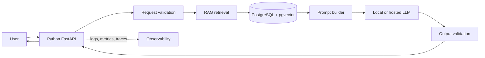
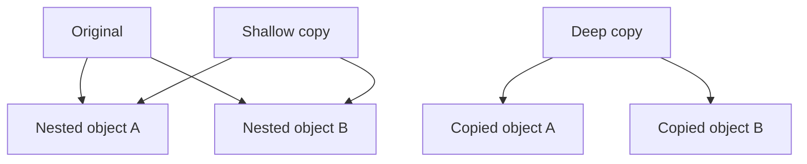
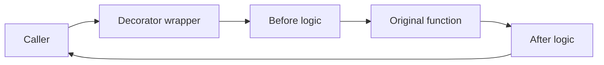
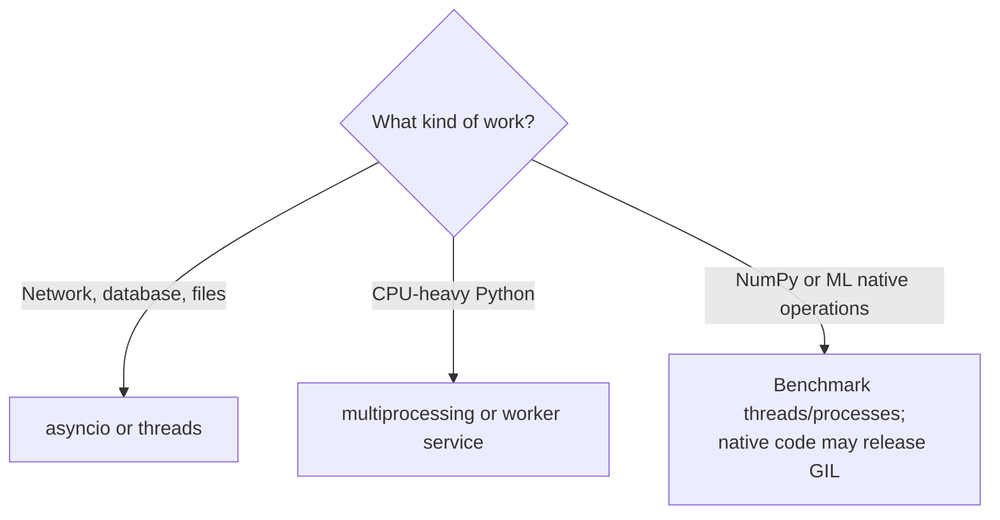
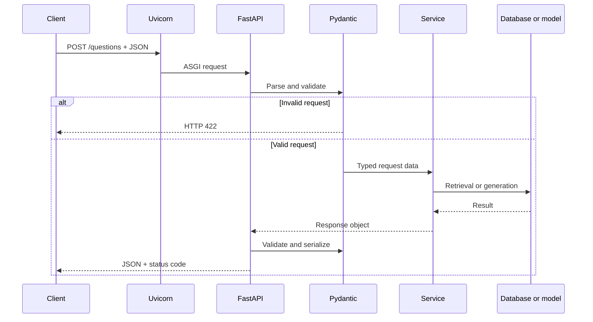
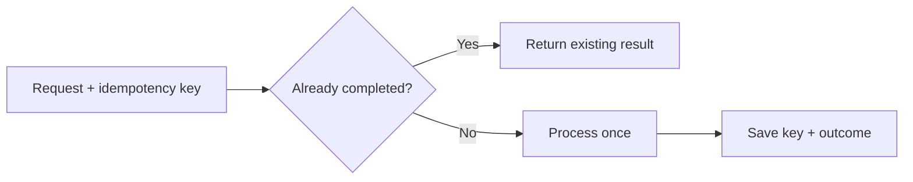
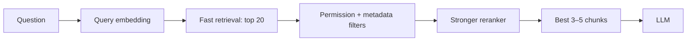
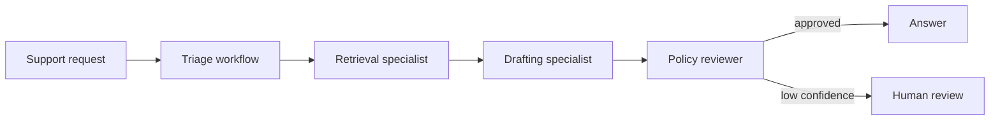
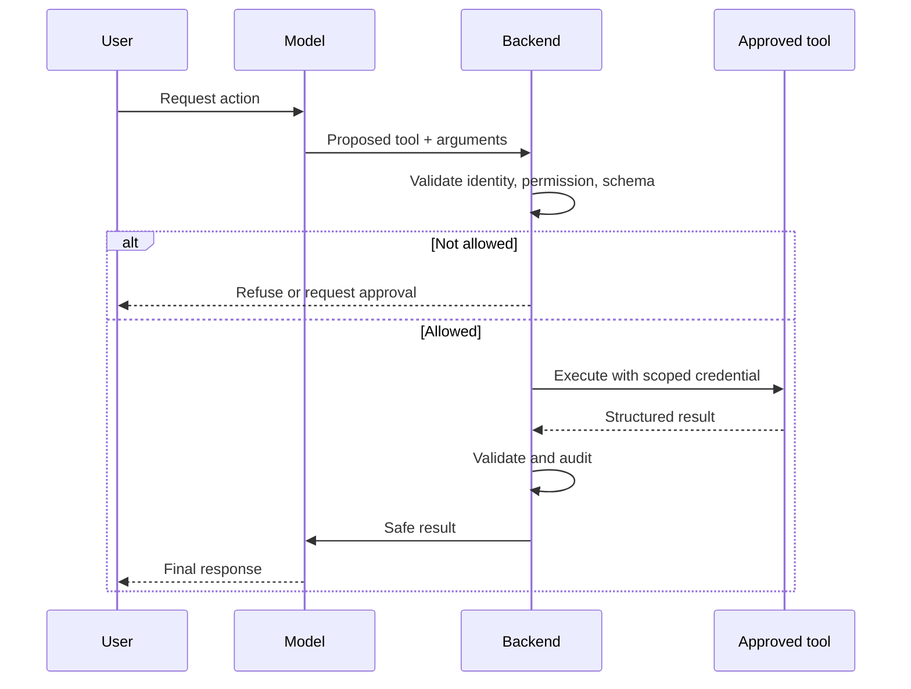
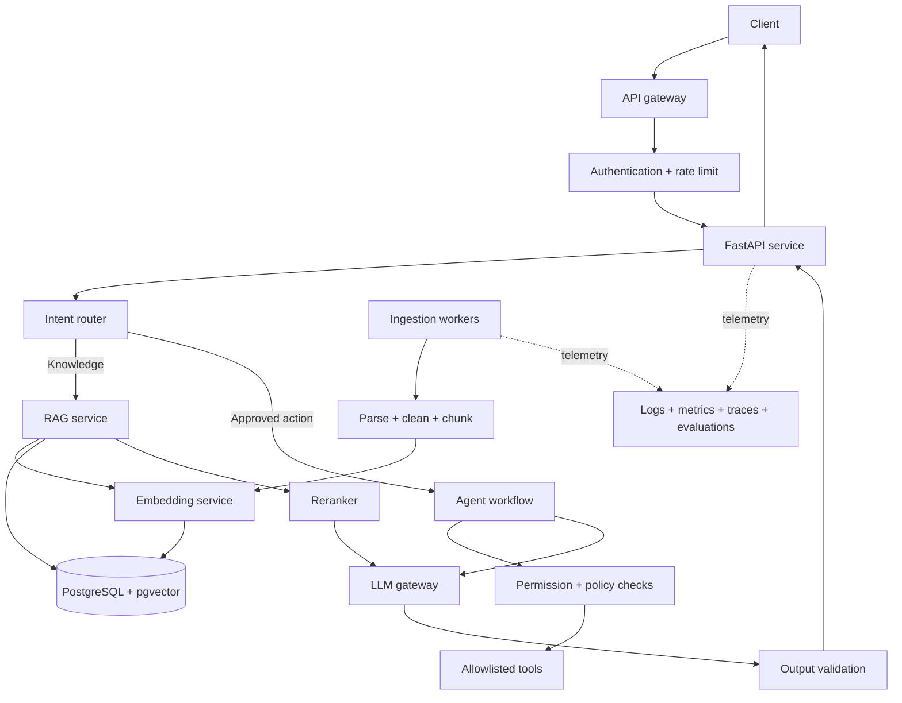

# Python Interview Sheet 2

## Advanced Python for Backend, RAG, and Multi-Agent Systems

This sheet extends `interview_cheatsheet.py` and connects Python fundamentals to production backend, Retrieval-Augmented Generation (RAG), and multi-agent engineering.

Use every question in three passes:

1. Answer aloud in 30–60 seconds.
2. Explain the code or flow without reading.
3. Describe one trade-off, failure mode, or production improvement.

---

## Visual overview: where Python fits




Python is the orchestration layer. It validates requests, applies permissions, retrieves evidence, calls models and tools, handles failures, and returns a stable response. The model does not receive direct authority over databases or business operations.

---

# Part 1 — Advanced Python Fundamentals

## 1. What is the difference between identity and equality?

### Interview answer

`==` compares values through equality behavior such as `__eq__`. `is` checks whether two references point to the exact same object. Use `is` for singletons such as `None`, and `==` for values.

```python
a = [1, 2]
b = [1, 2]
c = a

print(a == b)  # True: same value
print(a is b)  # False: different objects
print(a is c)  # True: same object

result = None
if result is None:
    print("No result")
```

Do not use `is` for strings or numbers merely because caching sometimes makes it appear to work.

---

## 2. Why are mutable default arguments dangerous?

### Interview answer

Default argument expressions are evaluated once when a function is defined, not on every call. A mutable default can therefore retain changes across calls.

```python
def bad_add(item, items=[]):
    items.append(item)
    return items


print(bad_add("a"))  # ['a']
print(bad_add("b"))  # ['a', 'b'] — shared state
```

Correct pattern:

```python
def add_item(item, items=None):
    if items is None:
        items = []

    items.append(item)
    return items
```

In a backend, accidental shared state could leak data between requests.

---

## 3. What is the difference between shallow and deep copying?

### Interview answer

A shallow copy creates a new outer container but reuses references to nested objects. A deep copy recursively copies nested objects. Deep copying provides more isolation but costs more time and memory.



```python
import copy

original = {"metadata": {"page": 3}}
shallow = original.copy()
deep = copy.deepcopy(original)

original["metadata"]["page"] = 9

print(shallow["metadata"]["page"])  # 9
print(deep["metadata"]["page"])     # 3
```

---

## 4. What are iterables, iterators, and generators?

### Interview answer

An iterable can produce an iterator through `iter()`. An iterator maintains state and returns values through `next()`. A generator is a convenient iterator created by `yield` or a generator expression.

```python
def read_chunks(document: str, size: int):
    for start in range(0, len(document), size):
        yield document[start : start + size]


for chunk in read_chunks("abcdefghij", 4):
    print(chunk)
```

Generators help process large files or streams lazily instead of loading everything into memory. They are normally consumed once.

---

## 5. How do decorators work?

### Interview answer

A decorator receives a function and returns a replacement function. `@decorator` is syntax for `function = decorator(function)`. Use `functools.wraps` to preserve the original function metadata.

```python
from functools import wraps
from time import perf_counter


def measure_time(function):
    @wraps(function)
    def wrapper(*args, **kwargs):
        start = perf_counter()
        try:
            return function(*args, **kwargs)
        finally:
            duration = perf_counter() - start
            print(f"{function.__name__}: {duration:.3f}s")

    return wrapper


@measure_time
def retrieve_documents(question: str):
    return [question]
```



Common uses include authentication, logging, timing, retries, caching, and route registration. Retries must be bounded and used only where repetition is safe.

---

## 6. What is a context manager?

### Interview answer

A context manager controls setup and cleanup around a block. The `with` statement guarantees cleanup even when an exception occurs.

```python
with open("document.txt", encoding="utf-8") as file:
    text = file.read()

# File is closed here.
```

```python
with psycopg.connect(database_url) as connection:
    with connection.cursor() as cursor:
        cursor.execute("SELECT id, title FROM documents")
        rows = cursor.fetchall()
```

Using a cursor after leaving its block fails because the resource is closed.

---

## 7. Explain exception-handling best practices.

### Interview answer

Catch the narrowest exceptions you can handle, preserve the original cause with `raise ... from error`, log details internally, and return stable safe errors to clients. Do not convert an infrastructure failure into a valid empty result.

```python
class GenerationUnavailableError(RuntimeError):
    pass


def generate_answer(client, prompt):
    try:
        return client.generate(prompt)
    except TimeoutError as error:
        raise GenerationUnavailableError(
            "Generation service unavailable"
        ) from error
```

Bad pattern:

```python
try:
    return query_database()
except Exception:
    return []  # Hides outages and programming errors
```

---

## 8. When should you use a dictionary, dataclass, or Pydantic model?

| Choice | Best use | Main property |
|---|---|---|
| Dictionary | Flexible temporary/internal data | No automatic schema validation |
| `dataclass` | Typed internal domain objects | Lightweight generated methods |
| Pydantic model | API and configuration boundaries | Runtime validation and serialization |

```python
from dataclasses import dataclass
from pydantic import BaseModel, Field


@dataclass
class RetrievedChunk:
    chunk_id: int
    content: str
    similarity: float


class QuestionRequest(BaseModel):
    question: str = Field(min_length=3, max_length=500)
```

Validate untrusted data at system boundaries so internal code can work with stronger assumptions.

---

## 9. What is the GIL, and when does it matter?

### Interview answer

In standard CPython, the Global Interpreter Lock allows only one thread at a time to execute Python bytecode within an interpreter. Threads still help I/O-bound work because the GIL is released while waiting. For CPU-bound pure Python work, use multiprocessing or native libraries that release the GIL when measurement supports it.



HTTP calls to Ollama and PostgreSQL are I/O-bound. Model execution may run in native code or in a separate model server.

---

## 10. How does `async`/`await` work?

### Interview answer

`asyncio` provides cooperative concurrency. A coroutine yields control at `await` while waiting for asynchronous I/O. An `async def` function does not automatically make blocking code non-blocking.

```python
import asyncio


async def fetch_one(client, url):
    response = await client.get(url)
    return response.json()


async def fetch_all(client, urls):
    return await asyncio.gather(
        *(fetch_one(client, url) for url in urls)
    )
```

FastAPI trap:

```python
@app.get("/wrong")
async def wrong():
    return blocking_database_call()  # Blocks the event loop
```

Use an asynchronous driver or a normal `def` route that FastAPI can place in its thread pool.

---

# Part 2 — Python Backend Questions

## 11. What happens when a FastAPI request arrives?



### Interview answer

Uvicorn receives the request through ASGI. FastAPI matches the route, resolves dependencies, and asks Pydantic to validate input. The route calls the service layer. FastAPI then validates and serializes the declared response.

---

## 12. Why should routes remain thin?

### Interview answer

Routes translate HTTP concepts into application calls: validate input, invoke a service, and map results or exceptions to responses. SQL, retrieval, prompt construction, and model calls belong in dedicated modules so they can be tested independently.

```text
Route: HTTP concerns
Service: use-case orchestration
Repository: database access
Model client: LLM communication
Schema: boundary validation
```

```python
@app.post("/questions", response_model=QuestionResponse)
def ask(request: QuestionRequest):
    return rag_service.answer_question(request.question)
```

---

## 13. Which HTTP status codes fit an AI API?

| Code | Meaning |
|---|---|
| `200` | Valid request, including a safe “not enough information” result |
| `201` | An ingestion resource/job was created |
| `401` | Authentication missing or invalid |
| `403` | User lacks permission |
| `404` | Requested resource does not exist |
| `409` | Duplicate or conflicting request |
| `422` | Request body failed validation |
| `429` | Rate limit exceeded |
| `503` | Database, model server, or dependency unavailable |

“No relevant knowledge” is normally a valid domain outcome, not a server failure.

---

## 14. Why use database connection pooling?

Opening a connection involves network and authentication work. A bounded pool reuses connections, lowers latency, and prevents workers from opening unlimited connections.

```text
Maximum connections ≈ instances × workers × pool size
```

A pool that is too small causes waiting. A pool that is too large can exhaust PostgreSQL.

---

## 15. What is idempotency?

An idempotent operation produces the same intended result when repeated. It matters when clients or workers retry after uncertain failures.



For document ingestion, a unique source path and version can prevent retrying the same job from creating duplicate chunks.

---

# Part 3 — Python RAG Questions


## 16. What is the difference between ingestion time and query time?

### Interview answer

Ingestion runs when knowledge changes: parse, clean, chunk, embed, and store text, vectors, and metadata. Query time runs for every question: validate, embed the question, retrieve permitted evidence, threshold or rerank it, build the prompt, generate, and validate.

```text
Ingestion: document → chunks → embeddings → vector database
Query:     question → embedding → retrieval → prompt → answer
```

Re-embedding documents for every question would be slow and wasteful.

---

## 17. Why must queries and documents use the same embedding model?

An embedding model defines a coordinate space. Query and document vectors must share that space for distance to mean semantic similarity. Different dimensions may fail immediately; equal dimensions from different models may still produce meaningless scores.

Store the embedding model and version so re-embedding can be controlled.

---

## 18. How does pgvector retrieval work?

```sql
SELECT
    id,
    content,
    1 - (embedding <=> %s) AS similarity
FROM document_chunks
WHERE tenant_id = %s
ORDER BY embedding <=> %s
LIMIT 5;
```

The question is embedded using the chunk embedding model. `<=>` calculates cosine distance. The application can use `1 - distance` as similarity, apply permissions and metadata filters, and select top-k evidence.

Permission filtering must happen before evidence reaches the model.

---

## 19. Why does nearest not necessarily mean relevant?

Vector search ranks available candidates even when all are poor.

```text
Password question → Password chunk → similarity 0.453 → accept
Weather question  → Support chunk  → similarity 0.116 → reject
```

Use evaluation-driven thresholds, metadata filters, hybrid retrieval, reranking, and a fallback. A threshold that is too low causes false positives; one that is too high causes false negatives.

---

## 20. What is the chunk-size trade-off?

| Choice | Benefit | Risk |
|---|---|---|
| Large chunk | More surrounding context | Mixed topics and wasted prompt space |
| Small chunk | Precise match | Missing conditions or explanations |
| More overlap | Protects boundary information | Duplicate storage and results |
| No overlap | Minimal duplication | Ideas split across boundaries |

Start with headings and paragraphs, then measure. Store source, page/section, position, version, tenant, and permission metadata with every chunk.

---

## 21. What are top-k retrieval and reranking?



Initial retrieval is fast and optimized for recall. A reranker evaluates the query and candidate text together for better precision. It adds latency and compute, so introduce it only after evaluating the baseline.

---

## 22. How do you evaluate a RAG system?

| Layer | Evaluation |
|---|---|
| Ingestion | Were files parsed and chunked correctly? |
| Retrieval | Recall@k, precision@k, Mean Reciprocal Rank |
| Threshold | False-positive and false-negative rates |
| Generation | Is every claim supported by evidence? |
| Citation | Does the cited chunk support the answer? |
| Operations | Latency, errors, tokens/compute, throughput |
| Safety | Prompt injection, permission leaks, sensitive data |

Correct retrieval does not guarantee correct generation. If a source says 30 days and the model answers 90 days, retrieval succeeded but groundedness failed.

---

# Part 4 — Agents and Multi-Agent Systems

## 23. What is the difference between RAG and an agent?

| RAG pipeline | Agent workflow |
|---|---|
| Predetermined retrieve-and-answer flow | Chooses among steps or tools |
| Best for knowledge questions | Best for goal-oriented actions |
| Easier to test | More flexible but more failure modes |
| Usually one retrieval path | May loop, branch, retry, or request approval |

RAG retrieves evidence for generation. An agent uses an LLM in a controlled loop to choose approved tools until a goal is complete. RAG can be one tool inside an agent.

---

## 24. When should you use multiple agents?

Use multiple agents when tasks contain genuinely independent specialist roles, distinct permissions, or review stages that improve a measured outcome.



Avoid multiple agents when one deterministic service or one tool-using agent can finish reliably. More agents mean more latency, model calls, state, coordination, and debugging.

---

## 25. What role should CrewAI play?

CrewAI can define role-based agents, tasks, tools, and sequential or hierarchical collaboration. Use it after identifying a workflow that benefits from specialists—for example research, drafting, compliance review, and escalation.

```text
Research agent → retrieves approved sources
Draft agent    → creates a candidate answer
Review agent   → checks evidence and policy
Human          → approves high-risk output
```

Keep authorization, tool execution, validation, and durable state in application infrastructure rather than relying on role prompts alone.

---

## 26. How should agent tools be secured?

The model proposes a tool and arguments. Backend code authenticates the user, authorizes the action, validates arguments, executes an allowlisted tool with scoped credentials, validates its result, and records an audit trace.



The model should never receive raw database credentials or unrestricted shell/API access.

---

## 27. What is agent memory?

| Memory | Example | Main concern |
|---|---|---|
| Working | Current messages and task state | Context growth |
| Semantic | Retrieved company knowledge | Relevance and permissions |
| Episodic | Previous task outcomes | Accuracy and retention |
| Long-term user | Saved preferences | Consent and privacy |

Memory should be explicit, scoped, permission-aware, sourced, and removable. Retrieve or summarize only what the current task needs.

---

## 28. What is prompt injection in an agent system?

Direct injection comes from a user. Indirect injection is hidden in documents, websites, emails, or tool results. It attempts to make untrusted data behave like higher-priority instructions.

Defenses include:

- Trusted system instructions
- Clear data delimiters
- Approved sources
- Permission filters before retrieval
- Minimum tool permissions
- Argument and output validation
- Human approval for high-impact actions
- Injection evaluation cases and auditing

Prompt wording alone is not a complete security boundary.

---

## 29. How do you make an agent workflow reliable?

```text
Explicit state
→ bounded steps
→ typed tool schemas
→ timeouts
→ bounded retries
→ idempotent actions
→ checkpoints
→ human approval
→ traces and evaluation
```

Define terminal conditions, limit iterations and calls, persist state when needed, make side effects idempotent, require approval for high-risk actions, and trace model and tool decisions.

---

# Part 5 — System Design Interview

## 30. Design a production customer-support AI assistant.

### Requirements to clarify

- Which sources are approved?
- How fresh must information be?
- Is the system advisory or allowed to act?
- Which users can access which documents?
- What latency and traffic are expected?
- Which requests require human review?
- Which quality targets define success?

### High-level design



### Request-flow solution

1. Authenticate the caller and determine permissions.
2. Validate and normalize the request.
3. Route knowledge questions to RAG and actions to controlled workflows.
4. Embed the question and retrieve only permitted chunks.
5. Apply thresholding, top-k selection, and reranking.
6. If evidence is insufficient, return a fallback or human escalation.
7. Build a prompt that treats retrieved content as data.
8. Call the model through a gateway with timeouts and bounded retries.
9. Validate output and attach backend-controlled citations.
10. Record latency, retrieval, model version, prompt version, and outcome.

### Scaling discussion

- Use a bounded database connection pool.
- Process ingestion with a queue and idempotent workers.
- Batch embeddings.
- Add an HNSW index only after measuring exact-search latency.
- Separate API, ingestion, and model workloads.
- Version documents, chunks, prompts, and models.
- Re-embed gradually when changing embedding models.
- Load-test concurrency and dependency failures.

### Failure handling

| Failure | Expected behavior |
|---|---|
| Database unavailable | Return `503`; do not claim there is no answer |
| LLM unavailable | Bounded safe retry, then fallback or `503` |
| Weak retrieval | Skip generation and escalate/fallback |
| Duplicate ingestion | Idempotently return existing result |
| Prompt injection | Isolate content, refuse action, and log |
| Unauthorized match | Filter before building model context |

### Interview-ready closing answer

> I would begin with a deterministic, evaluated RAG service rather than a complex agent system. Python and FastAPI provide the API and orchestration layer, PostgreSQL with pgvector stores evidence and permission metadata, and workers parse, chunk, and embed approved sources. The backend owns authorization, thresholds, citations, tool execution, validation, and observability. I would introduce specialist agents only when a measured multi-step workflow requires them.

---

# Rapid-fire review

1. Why should `None` be checked with `is`?
2. Why is a mutable default argument shared?
3. When is a generator preferable to a list?
4. What does `functools.wraps` preserve?
5. When is a cursor closed?
6. Why is catching `Exception` usually too broad?
7. When should a FastAPI route use normal `def`?
8. Why is pool size a system-level decision?
9. What makes ingestion idempotent?
10. Why must query and document embeddings use the same model?
11. How do cosine distance and similarity differ?
12. Why can nearest-neighbour retrieval be wrong?
13. What happens when a threshold is too high?
14. What is overlap for?
15. How do retrieval accuracy and groundedness differ?
16. Why should citations come from backend metadata?
17. When is RAG better than an agent?
18. When is multi-agent delegation justified?
19. Why should an LLM not directly execute database operations?
20. What controls make agent side effects safe?

---

# Final preparation checklist

- Explain every diagram without reading it.
- Run and modify every Python example.
- Give one real failure mode for each answer.
- Relate answers to the RAG project you built.
- Practice both a 60-second and a 3-minute answer.
- Distinguish model responsibilities from backend authority.
- State trade-offs instead of claiming one technology is always best.
- Use measured evaluation results when discussing thresholds or scale.
