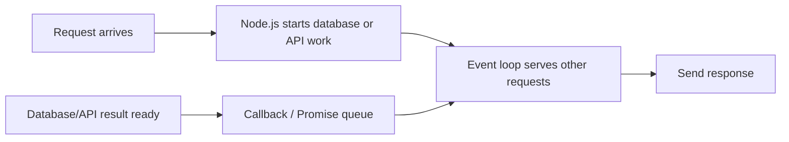
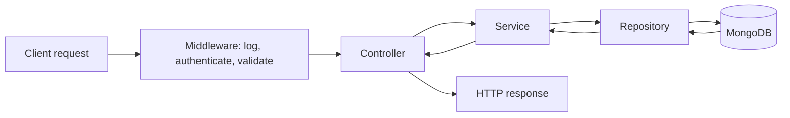
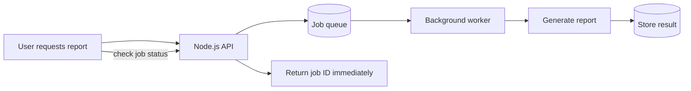
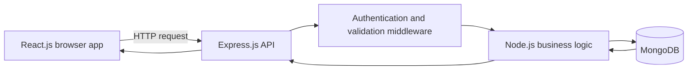

# Node.js and MongoDB Interview Questions and Answers

> Learn each definition, then use the real-life example to explain it naturally in an interview.

## Node.js fundamentals

### What is Node.js?

Node.js is a JavaScript runtime built on Google’s V8 JavaScript engine. It lets developers run JavaScript outside the browser, commonly for backend services, Application Programming Interfaces (APIs), command-line tools, and real-time applications.

**Real-life example:** React.js is the customer-facing restaurant menu; Node.js is the kitchen that receives the order, checks ingredients, talks to payment systems, and returns the result.

### Why is Node.js good for backend applications?

Node.js uses non-blocking Input/Output (I/O) and an event-driven model. While it waits for a database, file, or external API response, it can process other requests instead of blocking one thread.

**Good use cases:** chat applications, APIs, dashboards, streaming, notifications, proxy services, and AI services waiting on models or vector databases.

**Drawback:** Central Processing Unit (CPU)-heavy work, such as large video processing or complex machine learning computation, can block the event loop. Move that work to worker threads, queues, separate services, or specialized compute.

### How does the Node.js event loop work?

The event loop allows Node.js to coordinate asynchronous work. It starts an operation, continues serving other requests, and later runs the callback or Promise when the operation completes.



**Real-life example:** A waiter sends an order to the kitchen, then takes orders from other tables. The waiter does not stand still until one meal is finished.

### What is the difference between synchronous and asynchronous code?

| Style | Behavior | Advantage | Drawback | Example |
| --- | --- | --- | --- | --- |
| Synchronous | Wait for one task before starting the next | Easy to read for quick local work | Blocks progress while waiting | Wait at a counter until one customer is finished |
| Asynchronous | Start work and continue other tasks while waiting | Better for database/network I/O | Needs careful error handling | Waiter serves other tables while food cooks |

Use `async` and `await` for readable asynchronous code. Always use `try/catch` around awaited operations and return useful errors.

### What are callbacks, Promises, and async/await?

| Pattern | Meaning | Real-life example |
| --- | --- | --- |
| Callback | Function called after work finishes | “Call me when the courier arrives.” |
| Promise | Object representing a future result | Delivery tracking: pending, delivered, or failed |
| async/await | Readable syntax for waiting on a Promise | Wait for payment confirmation before confirming an order |

**Interview answer:** Promises solve many callback-nesting problems. `async/await` is syntax on top of Promises that makes asynchronous code easier to read and handle with `try/catch`.

### What are CommonJS and ECMAScript Modules?

Node.js supports two module systems.

| Module system | Syntax | Typical use |
| --- | --- | --- |
| CommonJS | `require()` and `module.exports` | Older Node.js projects |
| ECMAScript Modules (ESM) | `import` and `export` | Modern JavaScript projects |

**Real-life example:** Modules are labelled toolboxes. Instead of putting every tool in one room, import only the toolbox you need. Choose one module system consistently in a project to avoid configuration confusion.

### What are Buffers and streams?

A Buffer stores raw binary data in memory. A stream reads or writes data in smaller pieces instead of loading everything at once.

**Real-life example:** A Buffer is carrying an entire water tank at once. A stream is using a pipe that moves water continuously. For a very large file upload or video, streams reduce memory usage and begin processing earlier.

### What are worker threads and child processes?

| Option | Best use | Real-life example |
| --- | --- | --- |
| Worker thread | Central Processing Unit-heavy JavaScript work in the same Node.js application | Assign image calculation to a separate kitchen worker |
| Child process | Run another process or external command | Hire a separate specialist company for a different job |
| Queue worker | Slow/retryable background work | Put catering orders into a kitchen queue |

Do not use worker threads for ordinary database/API waiting; Node.js already handles Input/Output efficiently. Use them for work that would otherwise block the event loop.

### What is middleware in Express.js?

Express.js middleware is a function that runs between a request arriving and the final route handler responding. It can authenticate a user, validate input, log requests, handle errors, or parse JavaScript Object Notation (JSON).

```text
Request → logging → authentication → validation → route handler → response
```

**Real-life example:** Airport flow: security check → passport check → baggage check → boarding gate.

### What is a REST API?

Representational State Transfer (REST) is a resource-oriented design style for Hypertext Transfer Protocol (HTTP) APIs. Common methods are `GET` to read, `POST` to create, `PATCH` to partially update, and `DELETE` to remove.

```text
GET    /products/123       → read product 123
POST   /orders             → create an order
PATCH  /orders/123         → update order 123
DELETE /cart-items/99     → remove cart item 99
```

**Best practice:** validate request input, authenticate users, authorize access, return appropriate status codes, paginate list endpoints, and keep API contracts versioned when breaking changes are required.

### How do authentication and authorization differ?

Authentication asks, “Who are you?” Authorization asks, “Are you allowed to do this?”

**Real-life example:** Showing your employee identity card is authentication; being allowed into the finance room is authorization.

Use secure password hashing such as bcrypt or Argon2, short-lived access tokens, refresh-token rotation where appropriate, server-side role/permission checks, and secure Hypertext Transfer Protocol Secure (HTTPS) transport.

### How should errors be handled in a Node.js API?

Use centralized error middleware, structured error responses, error logging with request IDs, and do not expose stack traces or secrets to clients.

```json
{
  "error": {
    "code": "ORDER_NOT_FOUND",
    "message": "The requested order was not found."
  }
}
```

**Real-life example:** A receptionist gives a clear customer-friendly message while the technical team receives the detailed internal incident report.

## Building a small Node.js API service

### How should a Node.js API be structured?

Avoid placing routes, database queries, business rules, and error handling in one file. A layered structure makes the code testable and easier to change.

```text
src/
  routes/          → map URL and HTTP method to a controller
  controllers/     → read request and send response
  services/        → business rules and workflow
  repositories/    → database queries only
  models/          → MongoDB schema/model definitions
  middleware/      → authentication, validation, logging, errors
  app.js           → configure Express.js application
  server.js        → start HTTP server
```



**Real-life example:** In a restaurant, the host receives the customer, the waiter records the order, the kitchen applies cooking rules, the store room provides ingredients, and the waiter returns the meal. One person should not do every job.

### What does each layer do?

| Layer | Responsibility | What it should not do | Example |
| --- | --- | --- | --- |
| Route | Connect `POST /orders` to a controller | Contain business logic | Choose the correct counter |
| Controller | Read request and create HTTP response | Directly write complex database logic | Waiter receives and returns an order |
| Service | Validate business rules and coordinate work | Know Express.js request details | Kitchen decides whether stock is enough |
| Repository | Read/write database data | Decide business rules | Store-room employee finds ingredients |
| Middleware | Shared request checks | Contain one feature’s business workflow | Security checkpoint at the entrance |

### Small example: create an order API

**Route**

```javascript
router.post("/orders", requireUser, validateCreateOrder, createOrder);
```

**Controller**

```javascript
export async function createOrder(request, response, next) {
  try {
    const order = await orderService.create(request.user.id, request.body);
    return response.status(201).json(order);
  } catch (error) {
    next(error);
  }
}
```

**Service**

```javascript
export async function create(userId, input) {
  const product = await productRepository.findById(input.productId);
  if (!product || product.stock < input.quantity) {
    throw new AppError("INSUFFICIENT_STOCK", 409);
  }

  const order = await orderRepository.create({
    userId,
    productId: product.id,
    quantity: input.quantity,
    status: "created",
  });
  return order;
}
```

**Repository**

```javascript
export function create(data) {
  return OrderModel.create(data);
}
```

The controller stays thin. The service owns the rule “do not order more than stock.” The repository owns the MongoDB call.

### How do you validate API input?

Validate input before business logic. Check required fields, types, formats, allowed values, and boundaries.

```javascript
// Example rule: quantity must be a positive integer.
if (!Number.isInteger(body.quantity) || body.quantity < 1) {
  throw new AppError("INVALID_QUANTITY", 400);
}
```

Use a schema-validation library such as Zod, Joi, or express-validator. Validation protects the database and makes error messages predictable.

**Real-life example:** A courier form must have a valid address and phone number before the parcel is accepted.

### What is idempotency, and why does it matter for APIs?

An idempotent request can be safely repeated without creating an unintended extra result. This matters when clients retry after a timeout.

**Example:** If a user clicks “Pay” twice or the mobile network retries `POST /payments`, an idempotency key lets the server return the original payment result instead of charging twice.

```text
Client sends Idempotency-Key: payment-abc-123
        ↓
Server saves key + result
        ↓
Same key received again → return original result
```

### What is a service layer, and why is it useful?

A service layer holds reusable business rules between controllers and repositories. It prevents duplicated logic when the same action can be triggered by an HTTP API, a background worker, a command-line job, or an event consumer.

**Example:** `orderService.create()` can be used by `POST /orders` and by a “reorder previous items” background job. Both follow the same stock and permission rules.

### What is dependency injection?

Dependency injection means passing a dependency into a class or function instead of creating it internally.

```javascript
function createOrderService({ productRepository, orderRepository }) {
  return { create: async (userId, input) => { /* use injected repositories */ } };
}
```

**Advantage:** easier testing, because a test can pass a fake repository. **Drawback:** extra setup and abstractions for very small applications.

**Real-life example:** A chef receives ingredients from a supplier rather than building a farm inside the kitchen.

### How do you test a Node.js API?

| Test level | What it checks | Example |
| --- | --- | --- |
| Unit test | One small function or service rule | Reject order when stock is insufficient |
| Integration test | Multiple layers with database/API dependency | `POST /orders` creates an order in test database |
| End-to-end test | Full user flow | User logs in, adds item, pays, and sees order |

Use a separate test database. Mock only external systems where needed. Test both success and failure cases: invalid input, unauthorized user, missing product, duplicate request, and database failure.

### What security controls should a Node.js API have?

- Use Hypertext Transfer Protocol Secure (HTTPS).
- Authenticate users and authorize every sensitive action server-side.
- Validate and limit request bodies, query parameters, and uploaded files.
- Use secure password hashing; never store plain passwords.
- Rate-limit login and public endpoints.
- Configure Cross-Origin Resource Sharing (CORS) carefully.
- Avoid leaking stack traces, tokens, or database errors.
- Store secrets in environment variables or a secret manager, never in source control.
- Keep dependencies updated and scan for known vulnerabilities.

### How do queues and background workers help Node.js?

Move slow tasks out of the request-response path: report generation, email, image processing, notifications, and long Artificial Intelligence jobs.



**Real-life example:** A restaurant gives a token number for a large catering order instead of making the customer wait at the counter until all food is prepared.

### How does a Node.js service call an Artificial Intelligence service safely?

1. Authenticate the user and check authorization.
2. Validate and sanitize user input.
3. Apply input size limits and rate limits.
4. Retrieve only permitted context or call allowlisted tools.
5. Send the request to the Large Language Model provider with a timeout.
6. Validate structured output before using it in business logic.
7. Log request IDs, latency, cost, and safety events without logging secrets.
8. Require human approval for high-impact actions.

**Example:** A Node.js order assistant can ask an LLM to explain an order delay, but the backend—not the LLM—must call the order database and decide whether a refund is allowed.

### How do you scale Node.js applications?

1. Keep the API stateless; store sessions/state in shared services.
2. Run multiple processes/containers behind a load balancer.
3. Cache repeated reads using Redis or a Content Delivery Network (CDN) where appropriate.
4. Use queues for slow jobs such as email, report generation, or AI processing.
5. Add database indexes and monitor slow queries.
6. Track errors, latency, memory, CPU, and event-loop delay.

## MongoDB fundamentals

### What is MongoDB?

MongoDB is a document-oriented NoSQL database. It stores data as flexible Binary JSON (BSON) documents inside collections instead of fixed rows and tables.

```json
{
  "_id": "order_123",
  "customer": { "name": "Ravi", "city": "Mumbai" },
  "items": [{ "product": "Blue shirt", "quantity": 2 }],
  "status": "shipped"
}
```

**Real-life example:** A relational database is like a strict spreadsheet with fixed columns. MongoDB is like a flexible customer file where different customers can have different useful details.

### What are documents, collections, and databases?

| MongoDB concept | Relational database comparison | Real-life example |
| --- | --- | --- |
| Document | Row / record | One customer file |
| Collection | Table | Cabinet containing customer files |
| Database | Database | Entire office records room |
| Field | Column | A labelled detail inside one file |

### When should I choose MongoDB instead of a relational database?

Choose MongoDB when data is naturally document-shaped, fields may vary, nested objects are common, and you want flexible schema evolution—for example product catalogs, user profiles, content, chat messages, and event data.

Choose a relational database when strict relationships, multi-table transactions, complex joins, and strong reporting are central—for example ledgers, accounting, or highly normalized financial data.

### What is embedding versus referencing in MongoDB?

| Strategy | Meaning | Advantage | Drawback | Example |
| --- | --- | --- | --- | --- |
| Embedding | Store related data inside one document | Fast single-document read; atomic update within document | Document can become large or duplicate data | Order contains its line items |
| Referencing | Store related data in separate collections using identifiers | Less duplication; works for large shared relationships | Requires extra query or aggregation | Order stores `customerId` and reads customer separately |

**Rule of thumb:** embed data that is usually read together and changes together. Reference data that is large, shared by many records, or changes independently.

### What are indexes in MongoDB?

An index is a data structure that speeds up queries, similar to the index at the end of a book. Without an index, MongoDB may scan many documents. With an index on `email`, it can locate a user much faster.

```javascript
db.users.createIndex({ email: 1 }, { unique: true })
```

**Drawback:** indexes use storage and slow writes because each insert/update must also update indexes. Create indexes based on real query patterns and inspect query plans with `explain()`.

### What is the MongoDB aggregation pipeline?

The aggregation pipeline processes documents in stages, like a factory production line.


Common stages: `$match` filters, `$project` chooses/reshapes fields, `$group` calculates totals, `$sort` orders results, `$lookup` joins another collection, and `$unwind` expands arrays.

### What are replication and sharding?

| Concept | Purpose | Real-life example |
| --- | --- | --- |
| Replica set | Copies data to multiple servers for availability and failover | Keep backup branches of a bank that can continue service if one branch closes |
| Sharding | Splits data across servers for very large scale | Divide customers by region across multiple warehouses |

Replica sets improve availability. Sharding improves capacity and throughput, but adds design and operational complexity. Start simple; shard only after measuring a real scale need.

### How do you make MongoDB secure and performant?

- Require authentication and least-privilege roles.
- Use Transport Layer Security (TLS) encryption for network traffic.
- Validate API input and prevent unrestricted queries from clients.
- Create indexes for filters, sorts, and joins used in real workloads.
- Return only needed fields and paginate large results.
- Use schema validation for important document rules.
- Back up data and monitor slow queries, memory, and replication health.

## MERN interview system flow

MongoDB, Express.js, React.js, and Node.js form the MERN stack.



### Final interview answer

> Node.js is well suited for Input/Output-heavy backend services because of its event-driven, non-blocking model. I use Express.js middleware for authentication, validation, and error handling. For MongoDB, I model documents based on access patterns, choose embedding or referencing deliberately, add indexes based on real queries, and use aggregation pipelines for reporting. I keep security, validation, monitoring, and scalability concerns in the backend rather than trusting the client.
