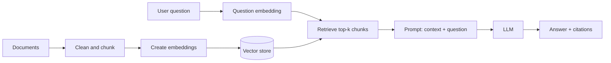
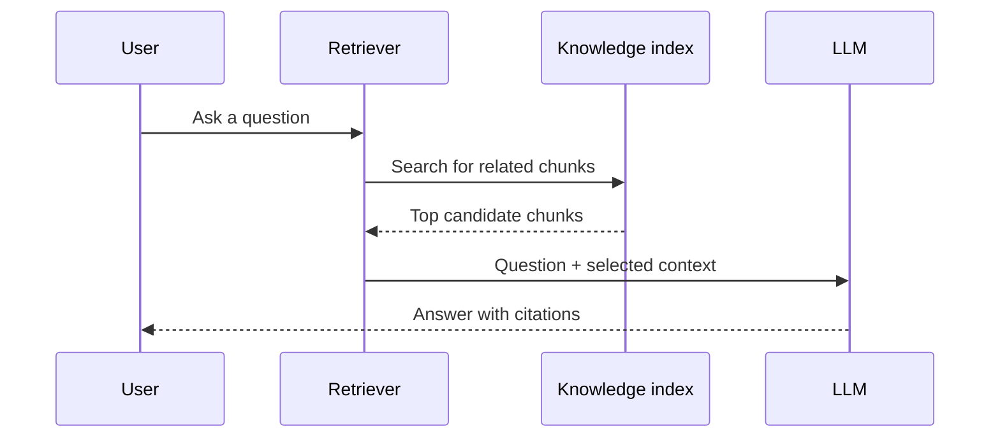
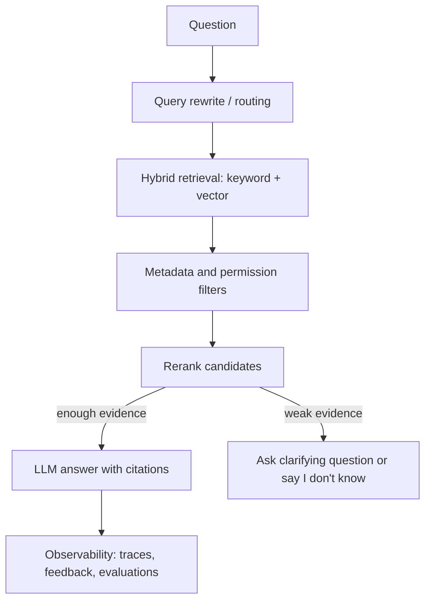

# 2. Visual RAG architecture

## Basic RAG

```mermaid
flowchart LR
  D[Documents] --> C[Clean and chunk]
  C --> E[Create embeddings]
  E --> V[(Vector store)]
  Q[User question] --> QE[Question embedding]
  QE --> R[Retrieve top-k chunks]
  V --> R
  R --> P[Prompt: context + question]
  P --> L[LLM]
  L --> A[Answer + citations]
```

## What happens at query time

```mermaid
sequenceDiagram
  participant U as User
  participant R as Retriever
  participant DB as Knowledge index
  participant L as LLM
  U->>R: Ask a question
  R->>DB: Search for related chunks
  DB-->>R: Top candidate chunks
  R->>L: Question + selected context
  L-->>U: Answer with citations
```

## Production-grade RAG

```mermaid
flowchart TD
  Q[Question] --> G[Query rewrite / routing]
  G --> H[Hybrid retrieval: keyword + vector]
  H --> F[Metadata and permission filters]
  F --> RR[Rerank candidates]
  RR -->|enough evidence| L[LLM answer with citations]
  RR -->|weak evidence| D[Ask clarifying question or say I don't know]
  L --> O[Observability: traces, feedback, evaluations]
```

The advanced pipeline adds controls around retrieval; it does not replace the core idea.
