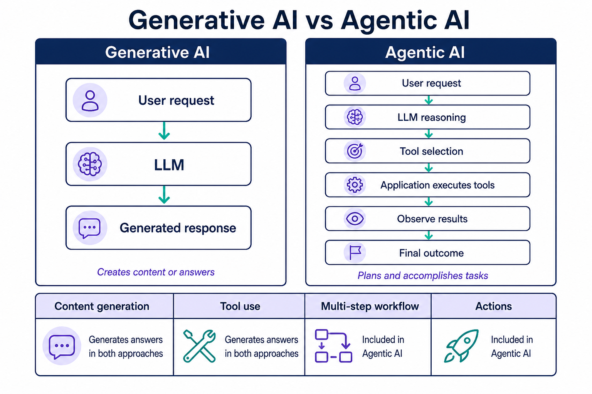
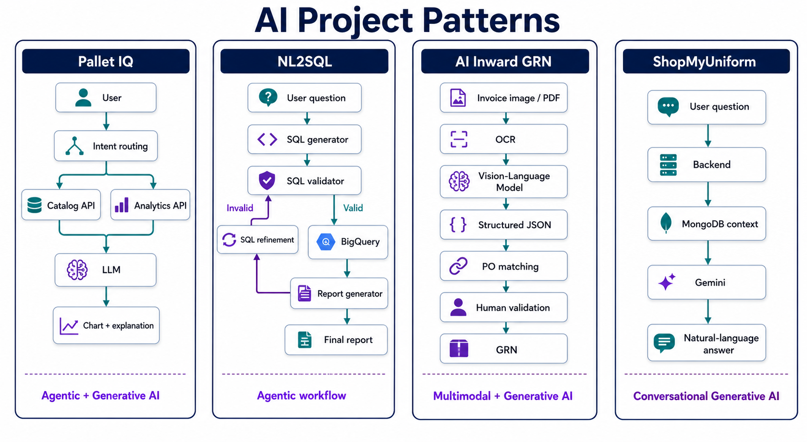

# Generative AI vs Agentic AI: Interview Guide

> **Generative AI creates. Agentic AI acts.**

They overlap, but they are not the same thing. Use this guide to explain your current-company work clearly in future interviews.



## 1. Generative AI

Generative AI primarily generates content or responses from an input.

```text
User: "Give me a summary of this invoice."
        ↓
      LLM
        ↓
"Invoice contains 12 products, total amount is ₹45,000..."
```

Common examples include ChatGPT generating text, Gemini summarizing documents, AI code generation, image generation, and conversational chatbots.

### ShopMyUniform example

```text
User: "Do you have Grade 7 black shoes?"
        ↓
Backend → query MongoDB inventory
        ↓
Gemini
        ↓
"Yes, black shoes are available..."
```

This is primarily **Generative AI / Conversational AI**: Gemini produces a natural-language response from supplied inventory context.

## 2. Agentic AI

Agentic AI goes further than answering a question. It can decide which actions are needed, execute tools, observe results, and continue a multi-step workflow.

```text
User: "Create a purchase order for 50 shirts"
        ↓
AI Agent
  ├── Understand request
  ├── Check inventory
  ├── Check supplier
  ├── Calculate quantity
  ├── Create PO
  └── Confirm result
```

The key distinction: the AI is not only generating text. It is **reasoning → selecting tools → executing actions → observing results → potentially taking another action**.

## 3. Simple comparison

| | Generative AI | Agentic AI |
| --- | --- | --- |
| Main purpose | Generate content or answers | Accomplish tasks |
| Generates text? | Yes | Yes |
| Uses tools? | Sometimes | Usually |
| Makes decisions? | Limited | Yes |
| Executes actions? | Usually no | Yes |
| Multi-step workflow | Usually no | Yes |
| Example | “Tell me today's sales” | “Analyze sales and create a report” |
| Example | “Write an email” | “Find customer → draft email → send email” |

## 4. Pallet IQ: agentic characteristics

Pallet IQ is closer to **Agentic AI + Generative AI** because it can route requests across business systems, obtain data, and turn the result into an insight.



```text
User: "Show me sales of category X"
        ↓
Intent / routing
   ├── Catalog API → product data
   └── Analytics API → sales results
        ↓
LLM
        ↓
Chart + explanation
```

For an action request such as “Create a new product called XYZ,” the workflow can be:

```text
Understand intent → validate required fields → call /product/v3/create
→ receive API response → explain result to user
```

That is agentic because the application performs and reports an action, rather than only describing one.

## 5. Tool calling

**Tool calling is a mechanism used to build agentic systems.** The LLM decides which application capability it needs; the application executes that capability. The LLM does not directly access the database.

```javascript
const tools = {
  getProduct,
  createProduct,
  getSales,
  createPurchaseOrder,
};
```

```text
User: "How many Nike shoes are in stock?"
        ↓
LLM decides it needs getProduct()
        ↓
Application executes getProduct("Nike shoes")
        ↓
Result is returned to the LLM
        ↓
LLM: "There are 127 Nike shoes in stock."
```

## 6. NL2SQL: agentic workflow

An NL2SQL agent is more agentic than a one-shot request to “write SQL” because it can validate and improve its work based on intermediate outcomes.

```text
User → SQL Generator → SQL Validator
                         ├── Valid → BigQuery → Results → Report Generator → Final report
                         └── Invalid → Refinement → Validate again
```

```text
Generate SQL → validate SQL → invalid → refine SQL → validate again
→ valid → execute → generate report
```

## 7. Multimodal AI

Multimodal AI works with more than one type of input or output: text, images, PDFs, audio, or video.

### AI Inward GRN example

```text
Invoice image / PDF → OCR → Vision-Language Model → structured JSON
→ PO matching → human validation → GRN
```

This is **Multimodal AI + Generative AI**. It becomes agentic when the system autonomously chooses and executes steps across the workflow.

## 8. Mental model

```text
AI
├── Predictive AI
└── Generative AI
    ├── Text, code, image, and multimodal generation
    └── Agentic AI
        ├── Reasoning
        ├── Tool use
        ├── Memory
        └── Actions
```

In short:

- **Generative AI:** “I’ll tell you how to do it.”
- **Agentic AI:** “I’ll figure out what needs to be done and do it.”

## Resume positioning

### Pallet IQ — Agentic AI + Generative AI

> Architected an enterprise AI Copilot using LLM-powered agentic workflows, tool calling, semantic routing, contextual retrieval, and SSE streaming to execute business operations and generate interactive insights.

### AI Inward GRN — Multimodal AI + Generative AI

> Built a multimodal Document AI pipeline using OCR and Vision-Language Models to extract structured invoice data and reconcile it against purchase orders.

### ShopMyUniform — Generative AI / Conversational AI

> Integrated a Gemini-powered conversational support chatbot with MongoDB-grounded product and order context, intent routing, prompt guardrails, and deterministic database fallback.

### NL2SQL — Agentic AI + Generative AI

> Developed a multi-agent Text-to-SQL system with SQL generation, validation, automated refinement, BigQuery execution, and report generation.

## Interview-ready answer

> Generative AI produces content, while Agentic AI combines an LLM with tools and workflow logic to accomplish a task. In my work, ShopMyUniform is mainly a grounded conversational GenAI use case. Pallet IQ and NL2SQL are closer to agentic systems because they route intent, call APIs or query systems, validate intermediate results, and return an outcome. AI Inward GRN is a multimodal document-AI workflow that can become agentic when it autonomously selects and performs those steps.
