# Advanced Multi-Agent AI Interview Guide

## From RAG fundamentals to production agent teams

This guide connects the RAG system you have built with agents, multi-agent orchestration, CrewAI, backend design, safety, evaluation, and production scaling. It is a detailed companion to `06_generative_vs_agentic_ai_interview_guide.md`.

> A multi-agent system is not several chatbots talking without control. It is a software workflow in which specialized decision-making components collaborate through explicit state, tools, contracts, permissions, and stopping rules.

The shared page was titled **Multi Agent Interview Topics**. Its conversation body was not exposed by the shared page, so this guide expands that topic using the concepts covered throughout this RAG learning project and the official references listed at the end.


---

# Part 1 — Complete mental model

## 1. Generative AI, RAG, agents, and multi-agent systems

| Concept | Main responsibility | Example |
| --- | --- | --- |
| Generative AI | Creates text, code, images, or structured output | Summarize a ticket |
| RAG | Retrieves trusted context before generation | Find a policy and answer with citations |
| Agent | Chooses and uses tools to achieve a goal | Search policy, inspect order, draft resolution |
| Multi-agent system | Coordinates specialized agents | Triage → retrieval → action → reviewer |

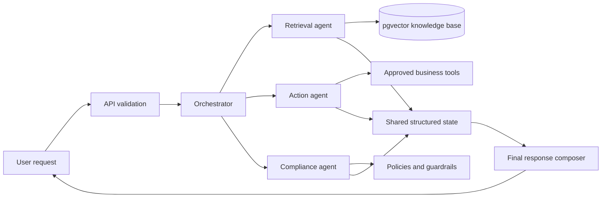

### Interview answer

> Generative AI produces content. RAG grounds generation in retrieved information. An agent adds a decision-and-action loop around an LLM. A multi-agent system separates a complex job into specialized roles and coordinates their outputs through an orchestrator or shared workflow. I introduce multiple agents only when specialization, context isolation, parallel work, or independent validation provides measurable value.

## 2. Workflow versus agent

A **workflow** follows application-defined paths. An **agent** dynamically decides the next step inside boundaries.

```text
Workflow: validate -> retrieve -> rerank -> generate -> cite
Agent:    observe -> decide -> call tool -> observe -> decide -> stop
```

Reliable production designs are usually hybrid:

- Code controls permissions, budgets, required stages, and irreversible actions.
- The LLM handles language understanding, semantic routing, planning, and synthesis.
- A state machine makes execution inspectable and recoverable.

Do not ask an LLM to decide something that deterministic code can decide more safely.

## 3. What makes an agent an agent?

An agent normally contains:

1. **Goal** — the required outcome.
2. **Instructions** — scope and constraints.
3. **Model** — reasoning and generation.
4. **Tools** — controlled functions it may call.
5. **State** — facts about the current run.
6. **Memory** — information retrieved or retained across steps.
7. **Policy** — authorization, budgets, and guardrails.
8. **Termination** — how execution stops.

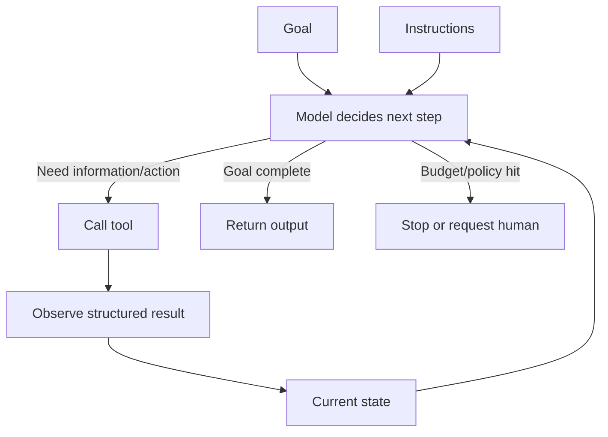

## 4. Agent loop and stopping rules

Without stopping rules, agents can repeat calls, consume tokens, and duplicate actions. Stop when:

- The goal state is reached.
- The output schema is valid.
- Maximum turns, tool calls, time, tokens, or cost is reached.
- Repeated steps produce no progress.
- Human approval is required.
- A safety policy blocks continuation.
- A tool returns a terminal business result.

A strong interview answer discusses both **success conditions** and **failure/budget conditions**.

---

# Part 2 — When multi-agent architecture is appropriate

## 5. Why not use multiple agents everywhere?

Every extra agent can add model calls, tokens, network latency, state, failure modes, conflicting outputs, and a larger security surface.

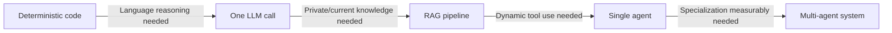

### Interview answer

> I start with the simplest architecture that satisfies the requirement. I move to multiple agents when a single agent has too many tools, incompatible contexts, independently testable specialties, parallel subtasks, or a valuable reviewer/executor separation. I validate that decision using success rate, latency, cost, and failure analysis.

## 6. Good reasons for specialized agents

Use multiple agents when:

- Domains require different instructions or permissions.
- One prompt is too large or internally conflicting.
- Independent subtasks can run in parallel.
- One component must independently critique another.
- Separate teams own capabilities behind stable contracts.
- A task needs staged access, such as research before a write.
- Context must be isolated to reduce noise or protect data.

Avoid it when:

- The task is a short Q&A.
- One deterministic chain solves it.
- Every agent has identical prompts and tools.
- Agent names are only labels around identical calls.
- Evaluation shows no improvement over one agent.

## 7. Customer-support agent team

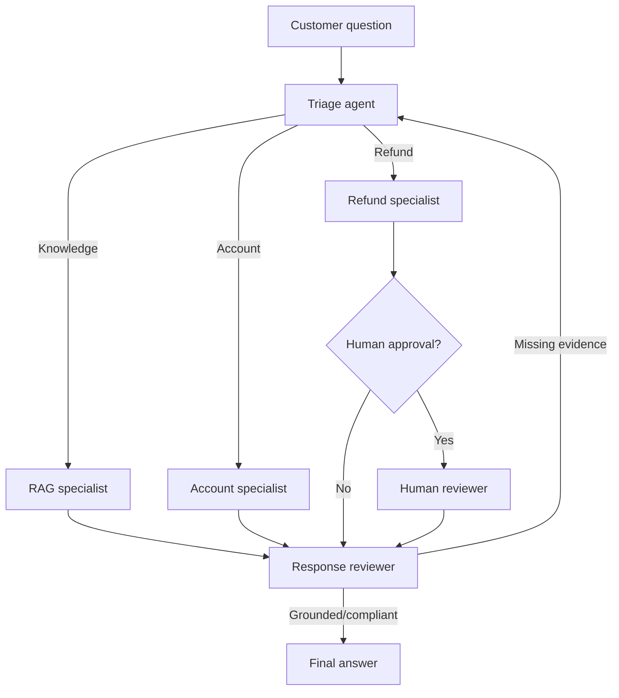

The triage agent should not have every tool. A refund agent should not read unrelated private records. A reviewer should usually verify output, not execute refunds.

---

# Part 3 — Orchestration patterns

## 8. Sequential pipeline

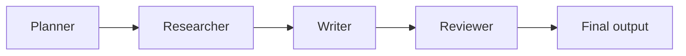

**Best for:** predictable stages, auditability, document processing, controlled RAG.

**Advantage:** simple to test. **Risk:** early errors propagate and every stage adds latency.

## 9. Router pattern

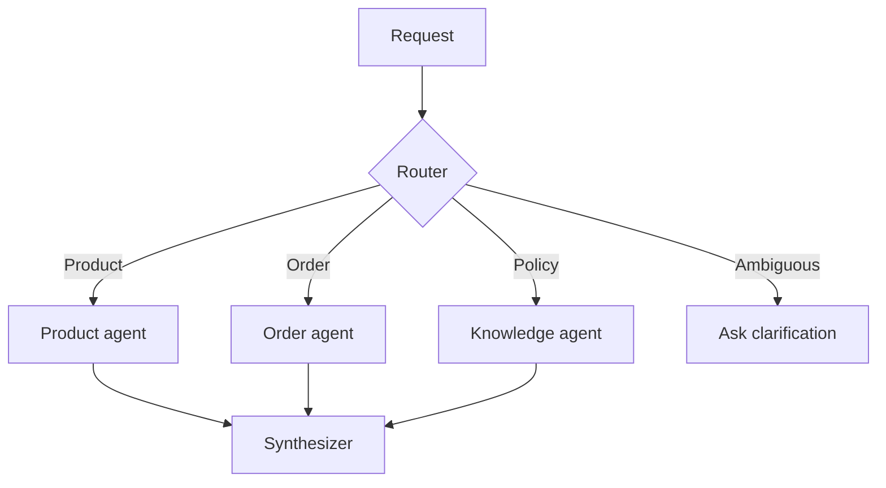

A router chooses one or more specialists. Low routing confidence needs a fallback instead of a forced guess.

## 10. Supervisor and workers

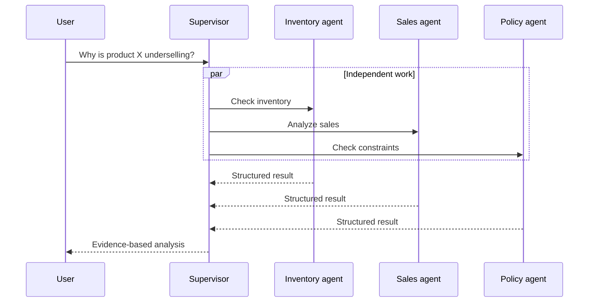

The supervisor decomposes, delegates, tracks completion, enforces budgets, and combines results. It can become a bottleneck and must not automatically receive every permission.

## 11. Handoff pattern

The active agent transfers ownership to another specialist:

```text
General support -> Billing specialist -> Human finance specialist
```

A handoff payload should contain the reason, user goal, verified facts, completed work, remaining work, permissions, constraints, and run ID.

Use handoff when ownership should move. Use supervisor/subagent calls when central control should remain with the coordinator.

## 12. Hierarchical teams

```text
Executive coordinator
├── Research manager
│   ├── Internal-knowledge agent
│   └── External-research agent
└── Operations manager
    ├── Inventory agent
    └── Order agent
```

Use hierarchy only when the team size and domain boundaries justify it. Deep hierarchies multiply cost and complicate causal tracing.

## 13. Parallel fan-out/fan-in

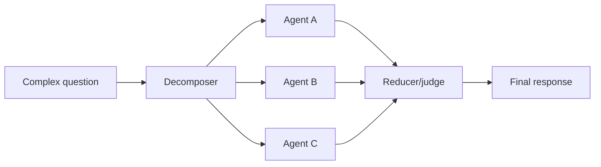

Parallel work improves wall-clock time only for independent subtasks. Avoid concurrent writes to the same record without transactions, locking, or conflict resolution.

## 14. Reviewer/reflection pattern

```text
Generator -> Reviewer -> accepted
                    └-> revision reasons -> Generator
```

Give the reviewer a rubric:

- Does every material claim have evidence?
- Do citations match retrieved chunks?
- Is the output schema valid?
- Is restricted data exposed?
- Did a tool report an error?

Limit revision attempts. Unbounded reflection creates loops.

## 15. Debate or voting

Several agents propose solutions and a judge selects or combines them. This can help difficult reasoning, but correlated models can repeat the same mistake. Agreement is not proof. The judge needs external evidence or deterministic checks.

## 16. Blackboard/shared state

```python
from typing import Any, TypedDict


class WorkflowState(TypedDict):
    run_id: str
    user_goal: str
    plan: list[str]
    evidence: list[dict[str, Any]]
    tool_results: list[dict[str, Any]]
    completed_steps: list[str]
    errors: list[str]
    final_answer: str | None
```

Do not use one giant conversation as the only state. Structured state supports validation, ownership, smaller prompts, recovery, and testing.

---

# Part 4 — Communication and context engineering

## 17. What should agents exchange?

Prefer minimal typed messages:

```python
from pydantic import BaseModel, Field


class AgentResult(BaseModel):
    task_id: str
    status: str
    summary: str
    evidence_ids: list[str] = Field(default_factory=list)
    confidence: float = Field(ge=0.0, le=1.0)
    errors: list[str] = Field(default_factory=list)
    requires_human: bool = False
```

A message from another agent is data to validate, not a trusted system instruction.

## 18. Context engineering

Context engineering decides what each model sees:

- Required system instructions.
- Relevant user messages.
- Relevant retrieved chunks.
- Trusted and sanitized tool results.
- Summarized prior steps.
- Excluded secrets and private fields.

More context is not always better. Irrelevant context increases tokens and can lower decision quality.

## 19. Direct versus orchestrator-mediated communication

| Direct agent-to-agent | Orchestrator-mediated |
| --- | --- |
| Flexible and dynamic | Central control |
| Harder to predict | Easier authorization/logging |
| Risk of message loops | Enforceable budgets |

Centralized orchestration is usually easier for a first production system.

## 20. MCP versus A2A

- **MCP:** connects an AI application to tools, resources, and context providers.
- **A2A:** supports communication/delegation between independently implemented agents.

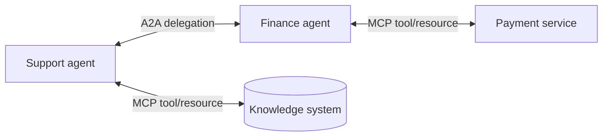

MCP and A2A are protocols, not agent frameworks. A2A is not a replacement for MCP.

---

# Part 5 — RAG inside a multi-agent system

## 21. Your current RAG flow, corrected

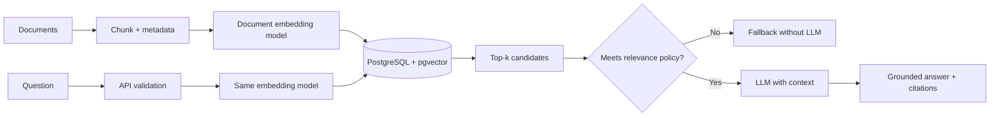

Important correction: pgvector computes vector distance/similarity. The LLM normally receives selected text context; it does not calculate the initial similarity score.

## 22. Compatible embedding models

Document and query embeddings must live in the same vector space and use expected dimensions. Your lock-and-key analogy works:

> The same company designs both lock and key. An unrelated key has a shape, but it does not represent the lock’s geometry.

When changing the embedding model, version the configuration and re-embed the collection before serving it from the new index.

## 23. Cosine distance, top-k, and threshold

For cosine distance:

```text
cosine_similarity = 1 - cosine_distance
```

- **Top-k** limits how many nearest candidates return.
- **Threshold** rejects candidates with insufficient relevance.
- **Reranking** performs a more accurate second-stage comparison.

The threshold is not the difference between two results. It is an acceptance boundary under your scoring convention.

## 24. False positives and false negatives

| Threshold | Likely effect |
| --- | --- |
| Higher/stricter | Fewer false positives, more false negatives |
| Lower/looser | More false positives, fewer false negatives |

- **False positive:** irrelevant context is accepted.
- **False negative:** relevant context is rejected.

There is no universal threshold such as `0.30`. Tune it with labeled questions from your data and confirm whether the query returns similarity or distance.

## 25. Fallback before LLM generation

```python
if not retrieved_chunks:
    return {
        "answer": "I could not find enough information in the knowledge base.",
        "citations": [],
        "grounded": False,
    }
```

This avoids unsupported answers, saves tokens, reduces latency, and creates predictable behavior.

## 26. Chunking trade-offs

- A whole PDF mixes unrelated ideas and weakens precise retrieval.
- Very large chunks waste context.
- Very small chunks lose surrounding meaning.
- Zero overlap can split an important idea.
- Too much overlap causes duplicates and token waste.

Prefer structure-aware chunks with headings, paragraphs, tables, pages, source IDs, tenant IDs, and access metadata.

## 27. Agentic RAG versus ordinary RAG

Ordinary RAG uses a predetermined retrieval path. Agentic RAG lets an agent decide whether, where, and how to retrieve, perhaps decomposing or rewriting the query.

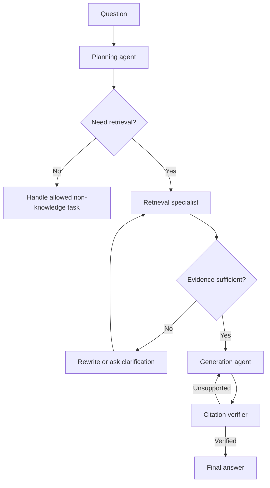

It helps multi-hop questions, query decomposition, or multiple collections. It is excessive for a simple FAQ lookup with a stable pipeline.

## 28. Possible RAG specialists

| Component | Responsibility | Must not do |
| --- | --- | --- |
| Router | Select domain/retrieval need | Execute privileged actions |
| Query planner | Split multi-hop questions | Invent facts |
| Retriever | Search permitted collections | Cross tenant boundaries |
| Reranker | Order candidate evidence | Generate final claims |
| Generator | Answer from evidence | Treat user text as policy |
| Citation verifier | Link claims to chunks | Approve unsupported claims |
| Safety reviewer | Check privacy/policy | Mutate business data |

Not every row should be an LLM agent. Retrieval, filtering, and reranking can be ordinary Python functions. Use “agent” only for meaningful decision autonomy.

---

# Part 6 — CrewAI and framework concepts

## 29. CrewAI mental model

```text
Agent = role + goal + instructions + model + tools
Task  = description + expected output + assigned agent
Crew  = agents + tasks + execution process
Flow  = state/event-driven application around crews and functions
```

Conceptual example—verify exact APIs against your installed version:

```python
researcher = Agent(
    role="Knowledge Researcher",
    goal="Find evidence relevant to a support question",
    tools=[search_knowledge_base],
)

reviewer = Agent(
    role="Grounding Reviewer",
    goal="Reject claims not supported by retrieved evidence",
    tools=[],
)

research_task = Task(
    description="Retrieve evidence for the validated question",
    expected_output="Structured evidence with source IDs",
    agent=researcher,
)
```

A framework does not replace authorization, typed state, tenant filters, timeouts, idempotency, or evaluation.

## 30. Sequential versus hierarchical CrewAI process

- **Sequential:** known task order; ideal for learning, predictable dependencies, and auditability.
- **Hierarchical:** a manager dynamically coordinates delegation; useful only when the added flexibility and model calls are justified.

Begin with two agents and two tasks, not eight agents.

## 31. Crew versus flow

A crew is a collaborating team for a bounded goal. A flow is the application control plane around it: state transitions, events, branches, persistence, and crew invocation.

```text
FastAPI endpoint
  -> validate request
  -> create run record
  -> flow
       -> deterministic retrieval
       -> invoke crew if needed
       -> require approval for writes
       -> persist final state
  -> API response
```

## 32. CrewAI, LangGraph, AutoGen, or custom Python?

| Style | Mental model | Good fit |
| --- | --- | --- |
| CrewAI | Roles, tasks, crews, processes, flows | Role-oriented business workflows |
| LangGraph | State, nodes, edges, checkpoints | Explicit branching and durable state |
| AutoGen AgentChat | Agents, messages, teams, termination | Conversational team collaboration |
| Custom Python | Functions, queues, database state | Narrow requirements and maximum control |

No framework is universally best. Compare control, persistence, observability, deployment, learning curve, ecosystem, and team familiarity.

---

# Part 7 — Tools, security, and guardrails

## 33. A tool is a controlled application function

The LLM proposes a tool call; application code validates and executes it.

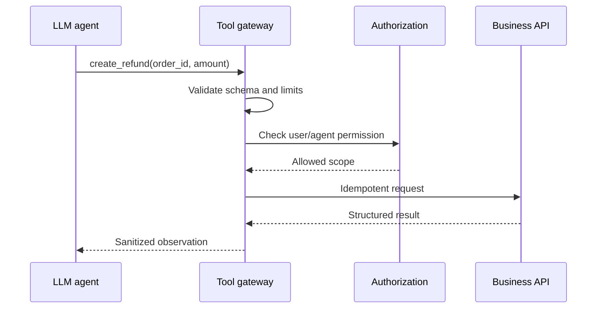

Never give unrestricted database or shell access because a prompt says “be careful.”

## 34. Tool contract best practices

Every tool needs:

- Narrow name and purpose.
- Typed, validated arguments.
- Least-privilege credentials.
- Tenant/ownership checks in code.
- Timeouts, retry policy, and rate limits.
- Idempotency for retryable writes.
- Structured success/error output.
- Audit logging and correlation IDs.
- Output limits and secret redaction.

## 35. Prompt injection in RAG and agents

Injection may be in user text, PDFs, websites, emails, or tool output.

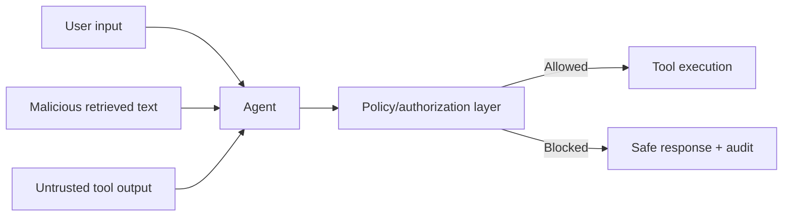

Defense in depth:

- Treat retrieved/tool content as data, not system policy.
- Enforce authorization outside prompts.
- Filter by tenant and user access before vector search.
- Allowlist tools per agent.
- Separate read tools from write tools.
- Validate arguments and outputs.
- Require confirmation for high-impact actions.
- Never put secrets into model context.

Guardrails reduce risk; they cannot guarantee perfect security.

## 36. Human approval

Require approval for payments, high-value refunds, deletion/publishing, legal/high-risk decisions, permission changes, external messages, or low-confidence contradictory evidence. Persist state before pausing so the run resumes without replaying actions.

## 37. Idempotency

Agents retry, networks fail, and workers restart. Write tools need an idempotency key:

```text
idempotency_key = workflow_run_id + logical_action_id
```

The service returns the first result for repeated keys instead of executing twice.

---

# Part 8 — State, memory, and persistence

## 38. State versus memory

| Type | Purpose | Example |
| --- | --- | --- |
| Run state | Current execution | Current step/tool calls |
| Conversation memory | Recent continuity | “Cancel that order” |
| Long-term memory | Durable validated facts | Notification preference |
| Knowledge base | Authoritative content | Refund policy |
| Audit log | Operational history | Approval actor/time |

Do not store every generated statement as memory. Generated text may be wrong. Validate, scope, expire, and allow deletion.

## 39. Shared memory risks

- Cross-user or cross-tenant leakage.
- Context poisoning.
- Stale preferences overriding the request.
- Context growth.
- Parallel update conflicts.

Namespace by `tenant_id`, `user_id`, `session_id`, and `workflow_id`. Define ownership and merge rules for each field.

## 40. Checkpointing

```text
planned -> evidence_retrieved -> approval_pending -> action_completed -> reviewed
```

Checkpoint after meaningful stages. Recovery must not repeat external side effects, which is why checkpoints and idempotent tools work together.

---

# Part 9 — Reliability, observability, and evaluation

## 41. What should be traced?

- Run, user, tenant, and correlation IDs.
- Routing choice and reason.
- Model/prompt version without secrets.
- Token usage.
- Tool, redacted arguments, duration, and status.
- Retrieval query, filters, chunk IDs, and scores.
- State transitions and handoffs.
- Retries, timeouts, and approvals.
- Citations and fallback reason.

Logs report events, traces show causal paths, and metrics describe aggregate health.

## 42. Evaluation layers

1. **Component:** routing accuracy and retrieval relevance.
2. **Interaction:** handoff completeness and reviewer detection.
3. **End-to-end:** correct user-goal completion.
4. **Operational:** latency, tokens, cost, retries, failures.

| Area | Metrics |
| --- | --- |
| Routing | Accuracy, clarification/fallback rate |
| Retrieval | Recall@k, precision@k, MRR, nDCG |
| Grounding | Supported-claim and citation-correctness rates |
| Tools | Selection accuracy, argument validity |
| Workflow | Completion, loop, handoff accuracy |
| Safety | Unauthorized actions, data leakage |
| Operations | p50/p95 latency, tokens, cost, timeouts |

## 43. LLM-as-judge limitations

An LLM judge can be biased, inconsistent, or influenced by confident wording. Combine it with schema validation, known-answer cases, business-rule assertions, citation checks, human samples, and adversarial tests.

## 44. Failure taxonomy

```text
validation failure
router failure
retrieval/reranking failure
planning failure
tool selection/execution failure
state/handoff failure
generation/grounding failure
authorization failure
```

This is more actionable than calling every issue “hallucination.”

## 45. Retry policy

Retry transient failures, not semantic mistakes without changing the inputs.

```python
RETRYABLE = {"timeout", "rate_limit", "temporary_unavailable"}

if result.error_type in RETRYABLE and attempts < max_attempts:
    retry_with_backoff()
else:
    fail_or_escalate()
```

For weak answers, revise the query, acquire evidence, alter the plan, or ask for clarification.

---

# Part 10 — Performance and scaling

## 46. Latency

```text
Sequential: router + agent A + agent B + reviewer
Parallel:   router + max(agent A, agent B, agent C) + reducer
```

Improve latency by using deterministic routing for obvious cases, smaller evaluated models for classification, concurrency for independent reads, safe caching, limited context, early fallback, and deadlines.

## 47. Queue-based execution

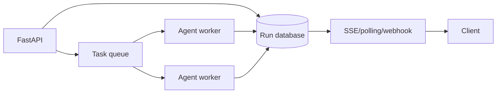

Long tasks should use durable state rather than worker memory, enabling horizontal scaling, recovery, and safe retry.

## 48. Cost controls

Set maximum turns, model calls, tool calls, retrieved tokens, retries, total time, and financial budget. Track cost per tenant, agent, model, feature, and successful outcome.

## 49. Concurrency and resources

Use PostgreSQL connection pools, bounded concurrency, rate limits, backpressure, transactions or optimistic locking, unique constraints, idempotency keys, and circuit breakers. Never launch unlimited agents because a plan has many subtasks.

---

# Part 11 — Production system-design answer

## 50. Enterprise multi-agent support assistant

### Requirements

- Answer product/policy questions with citations.
- Inspect authorized account/order information.
- Propose cancellations or refunds.
- Require approval for high-risk writes.
- Prevent cross-tenant access.
- Keep a complete audit trail.
- Fall back safely when evidence is missing.

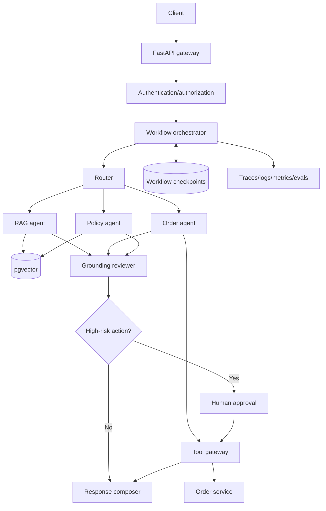

### Request lifecycle

1. FastAPI validates input.
2. Authentication identifies user and tenant.
3. Authorization calculates allowed data/actions.
4. Router selects a narrow specialist or clarification.
5. RAG searches authorized chunks only.
6. Action agents receive narrowly scoped tools.
7. Reviewer checks evidence, citations, policy, and tool errors.
8. High-risk writes pause for approval.
9. Write tools use idempotency keys.
10. Final state and audit trail are persisted.

### Data separation

```text
documents/chunks/embeddings -> knowledge retrieval
workflow_runs/checkpoints   -> resumable state
tool_audit_events           -> immutable action history
conversation_messages       -> user interaction
evaluation_results          -> quality data
```

### Failure behavior

- Vector DB unavailable: error or safe fallback; never guess.
- No acceptable retrieval: deterministic fallback without LLM.
- Business API timeout: policy-controlled safe retry.
- Reviewer rejection: bounded revision then escalation.
- Approval timeout: preserve pending state without action.
- Worker crash: resume without repeating writes.

### Scaling

- Stateless API replicas behind a load balancer.
- Queue workers scaled from pending runs.
- Database pooling and suitable vector indexes.
- Dependency-specific concurrency limits.
- Permission-safe caches for stable reads.
- Smaller models for routing/review after evaluation.

---

# Part 12 — Interview questions and model answers

## 51. What is a multi-agent system?

> Specialized agents coordinate toward a larger goal. Each has bounded responsibility, context, tools, and output contracts; orchestration controls routing, state, budgets, failures, and termination.

## 52. Is an agent an LLM?

> No. An LLM is a model. An agent is a software harness containing a model plus goals, instructions, tools, state, memory, policies, and an execution loop.

## 53. RAG versus memory?

> RAG retrieves authoritative knowledge for a query. Memory retains facts or state from previous interactions. Both may use vector retrieval, but their provenance, lifecycle, privacy, and correctness differ.

## 54. How do agents communicate safely?

> Through typed minimal messages with provenance and correlation IDs. Agent messages are validated as untrusted data, secrets are excluded, and authorization remains in application code.

## 55. How do you prevent loops?

> Define success states, maximum steps, time/token/tool budgets, repeated-state detection, bounded revisions, and escalation. Persist transitions for diagnosis and recovery.

## 56. How do you resolve conflicting answers?

> Compare them against authoritative evidence and deterministic rules. A reviewer follows a rubric rather than choosing confident prose. High-impact unresolved conflicts go to a human.

## 57. What does a supervisor do?

> It decomposes goals, assigns specialists, tracks progress, enforces budgets, handles failures, and combines structured results. It should not receive every permission by default.

## 58. Why use a reviewer agent?

> It separates generation from verification and checks grounding, citations, schema, policy, and completeness. Its value must be measured, and revision attempts must be bounded.

## 59. Can guardrails stop all injection?

> No. Use defense in depth: untrusted-content handling, minimal context, tool isolation, argument validation, code-level authorization, approval for risky actions, and adversarial evaluation.

## 60. How do you prove multi-agent is better?

> Compare it with a single-agent baseline on the same labeled tasks. Measure completion, correctness, safety, routing/retrieval/tool accuracy, latency, tokens, and cost per successful task. Keep the simpler system if there is no material gain.

---

# Part 13 — Common interview mistakes

Avoid:

- “More agents always improve accuracy.”
- “The LLM accesses the database directly.”
- “A reviewer guarantees correctness.”
- “The vector DB returns the answer.”
- “A `0.30` threshold works for every dataset.”
- “MCP and A2A are frameworks.”
- “Prompt instructions provide authorization.”
- “Store all agent memory forever.”
- “Retrying is always safe.”
- “CrewAI automatically handles security.”

Better explanations:

- The vector database returns candidates under a distance function.
- Retrieval policy, reranking, grounding, and evaluation determine usefulness.
- Application code owns credentials and validates tool calls.
- Agents operate within capabilities and budgets.
- Architecture is justified by measurable requirements.

---

# Part 14 — Small implementation path

Do not build everything at once.

## Step 1 — Design two components on paper

- `retrieval_agent`: evidence and source IDs.
- `review_agent`: accepts/rejects a draft using a rubric.

Define their schemas before prompts.

## Step 2 — Keep retrieval deterministic

Reuse the current pgvector search function. Initially, the retrieval specialist calls one controlled search tool rather than writing SQL.

## Step 3 — Add a plain-Python orchestrator

```python
def answer_question(question: str) -> dict:
    evidence = retrieve_evidence(question)
    if not evidence:
        return no_context_fallback()

    draft = generate_grounded_answer(question, evidence)
    review = review_grounding(draft, evidence)

    if not review.approved:
        return safe_review_fallback(review.reasons)

    return build_response(draft, evidence)
```

This is already a controlled multi-component workflow.

## Step 4 — Add tracing and evaluation

Record scores, evidence IDs, model calls, reviewer decisions, latency, and tokens. Test relevant, irrelevant, ambiguous, adversarial, and cross-tenant questions.

## Step 5 — Rebuild the same workflow with CrewAI

Compare accuracy, clarity, added calls, traceability, failure behavior, and stopping conditions with the plain-Python version.

## Step 6 — Add an action agent last

Start with a read-only tool. Add writes only with schema validation, authorization, idempotency, auditing, and human confirmation.

---

# Part 15 — Self-test

1. When would you replace one agent with three?
2. Router versus supervisor?
3. Handoff versus subagent call?
4. Why exchange structured results instead of transcripts?
5. How do top-k and threshold differ?
6. How does a stricter threshold affect false positives/negatives?
7. Why can a PDF contain prompt injection?
8. When must tenant filtering happen?
9. State versus memory versus knowledge base?
10. How do checkpoints and idempotency work together?
11. Which RAG stages should remain deterministic?
12. How would you prove a reviewer helps?
13. Why is agent agreement not proof?
14. MCP versus A2A?
15. Which metrics compare single and multi-agent systems?

---

# References

- [Shared ChatGPT topic — Multi Agent Interview Topics](https://chatgpt.com/share/6aa8161f-fba0-83ee-9780-0cd9b7a5a5ef)
- [CrewAI documentation](https://docs.crewai.com/)
- [LangChain multi-agent patterns](https://docs.langchain.com/oss/python/langchain/multi-agent)
- [LangGraph overview](https://docs.langchain.com/oss/python/langgraph/overview)
- [Microsoft AutoGen teams](https://microsoft.github.io/autogen/stable/user-guide/agentchat-user-guide/tutorial/teams.html)
- [Model Context Protocol](https://modelcontextprotocol.io/docs/getting-started/intro)
- [Agent2Agent Protocol](https://a2a-protocol.org/)

---

# Final revision summary

```text
Good multi-agent engineering
= justified specialization
+ explicit orchestration
+ least-privilege tools
+ structured state/messages
+ grounded retrieval
+ bounded loops/budgets
+ checkpoints/idempotency
+ human approval for risk
+ tracing/evaluation
```

The strongest interview answer explains not only what agents do, but **why the architecture is needed, how control and security are maintained, how failures are handled, and how improvement is measured**.
