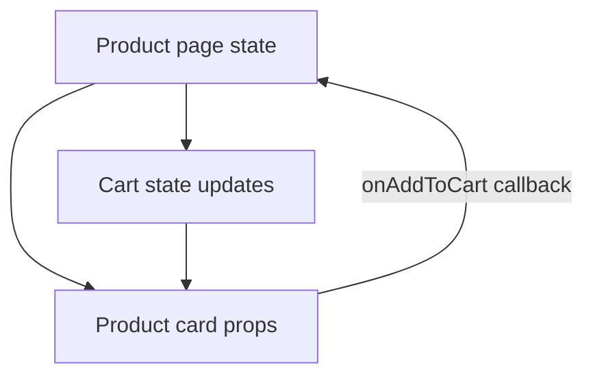
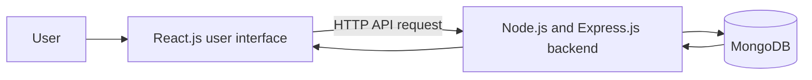

# React.js Interview Questions and Answers

> React.js is easiest to understand as a way to build a screen from data. When data changes, React updates the necessary part of the screen.

## React.js basics

### What is React.js?

React.js is a JavaScript library for building user interfaces using reusable components. A component receives data and returns a description of what should appear on the screen.

**Real-life example:** A shopping website is built from reusable blocks: header, search bar, product card, cart, and checkout form. A product card component can be reused for every product with different data.

### What is a component?

A component is a reusable, independent piece of user interface logic and layout.

```jsx
function ProductCard({ name, price }) {
  return <p>{name}: ₹{price}</p>;
}
```

**Real-life example:** A LEGO set uses the same block design repeatedly. `ProductCard` is the block; name and price are the values placed inside it.

### What are props and state?

| Concept | Meaning | Can the component change it? | Real-life example |
| --- | --- | --- | --- |
| Props | Data passed from parent to child | No; treat as read-only | A restaurant menu sent to a waiter |
| State | Data owned and updated by the component | Yes, using a state setter | The number of items currently in a cart |

**Interview answer:** Props are external inputs to a component. State is internal changing data. When state changes, React re-renders the component.

### What is rendering and re-rendering?

Rendering means React calculates what the user interface should look like from current props and state. Re-rendering happens when relevant props or state change.

**Real-life example:** A digital price board redraws the total only after a customer adds an item.

### What is the Virtual Document Object Model?

The Document Object Model (DOM) is the browser’s tree representation of the page. React keeps a lightweight in-memory representation, commonly called the Virtual DOM. It compares the previous and new representation, then updates only needed real DOM parts. This comparison process is called reconciliation.

**Real-life example:** Instead of repainting an entire restaurant menu board when one dish sells out, update only that dish’s availability label.

## Hooks

Hooks let function components use state, side effects, references, and shared context.

### What is useState?

`useState` stores component state.

```jsx
const [quantity, setQuantity] = useState(1);
```

Use it for local user interface state such as an open/closed modal, selected tab, form values, or cart quantity.

### What is useEffect?

`useEffect` runs a side effect after React renders. A side effect is work outside rendering: fetching data, subscribing to events, starting a timer, or connecting to a browser API.

```jsx
useEffect(() => {
  loadProducts();
}, []);
```

**Real-life example:** Opening a shop screen is rendering. Calling the warehouse to load products is a side effect.

**Common drawback:** an incorrect dependency array can cause stale data, repeated calls, or infinite loops. Keep render logic pure and include all required dependencies.

### What are useMemo and useCallback?

| Hook | Purpose | Real-life example | Avoid using it when |
| --- | --- | --- | --- |
| `useMemo` | Cache an expensive calculated value | Recalculate a large filtered product list only when filters change | Calculation is cheap |
| `useCallback` | Cache a function reference | Keep a callback stable when passed to a memoized child | Child is not memoized or no performance issue exists |

They are performance tools, not default requirements. First measure unnecessary renders before adding them.

### What is useRef?

`useRef` stores a value across renders without causing a re-render, and it can reference a DOM element.

**Real-life example:** A sticky note on an employee’s desk. Updating the note does not redraw the whole shop screen. Use it to focus an input, store a timer ID, or retain a previous value.

### What is useContext?

`useContext` lets multiple components access shared data without passing props through every intermediate component.

**Real-life example:** Every store employee can read the current language/theme from a notice board instead of one manager repeating it to every person.

**Drawback:** frequently changing large context values can cause broad re-renders. Split contexts or use a dedicated state-management approach when needed.

## Data flow and state management

### What is one-way data flow?

Data flows from parent components down to child components through props. Children notify parents through callback functions.



**Real-life example:** A manager gives staff the current menu. Staff tell the manager when a customer adds an item; the manager updates the central order list.

### What is lifting state up?

Move shared state to the closest common parent so multiple child components see the same source of truth.

**Example:** Product quantity selector and cart summary both need the current quantity, so store it in their parent component rather than separately in each child.

### When should I use local state, Context, or Redux?

| Option | Best for | Advantage | Drawback |
| --- | --- | --- | --- |
| Local component state | Small screen-specific values | Simple and close to usage | Hard to share widely |
| Context Application Programming Interface (API) | Theme, authenticated user, language | Built into React | Broad updates can re-render many consumers |
| Redux Toolkit | Large complex shared client state | Predictable updates and strong debugging | More concepts and code |
| Server-state library | Cached API data, loading, retries | Handles fetching/caching well | Adds a library and patterns |

## Forms, routing, and errors

### What are controlled and uncontrolled components?

| Type | Meaning | Best use |
| --- | --- | --- |
| Controlled input | React state is the source of truth for input value | Validation, dynamic forms, predictable behavior |
| Uncontrolled input | Browser Document Object Model keeps current value | Small simple forms or file inputs |

**Real-life example:** A controlled form is a receptionist writing every customer detail into the official register as it is spoken. An uncontrolled form is a customer filling a paper form that is read only when submitted.

### What is client-side routing?

Client-side routing changes the view based on the Uniform Resource Locator (URL) without loading an entire new page. React Router is a common library.

**Example:** Moving from `/products` to `/cart` feels immediate because the React application changes the component view while the browser history and URL update.

### What are error boundaries?

An error boundary catches rendering errors in part of a component tree and shows fallback user interface instead of crashing the full application. It does not catch every error, such as many asynchronous event-handler errors.

**Real-life example:** If one product card fails to render, show “This product is unavailable” rather than closing the entire online shop.

## Performance and security

### How do you optimize React.js performance?

1. Keep state close to where it is used.
2. Use stable keys for lists; do not use array indexes when list order can change.
3. Split large bundles with lazy loading.
4. Virtualize very long lists.
5. Avoid unnecessary state and unnecessary effects.
6. Use `useMemo`, `useCallback`, and `React.memo` only after measuring a real rendering issue.
7. Cache server data with an appropriate server-state library.

### What is Cross-Site Scripting?

Cross-Site Scripting (XSS) is an attack where untrusted content executes script in a user’s browser. React escapes text content by default, but unsafe Hypertext Markup Language (HTML) rendering such as `dangerouslySetInnerHTML` can introduce risk.

**Best practice:** never trust user-supplied HTML; sanitize it before rendering. Keep authorization on the backend because hiding a button in React does not prevent an unauthorized API request.

### Client-Side Rendering versus Server-Side Rendering

| Approach | Advantage | Drawback | Example |
| --- | --- | --- | --- |
| Client-Side Rendering (CSR) | Rich interactive application after JavaScript loads | Slower first paint on weak devices; Search Engine Optimization concerns | Internal dashboard |
| Server-Side Rendering (SSR) | Faster initial HTML and often better Search Engine Optimization | More server complexity | Public e-commerce product page |
| Static Site Generation (SSG) | Very fast cached static pages | Data can become stale until rebuild/revalidation | Documentation site |

## MERN interview system flow



### Final interview answer

> React.js uses reusable components and one-way data flow. I use props for read-only parent data and state for changing user interface data. Hooks such as `useState`, `useEffect`, `useContext`, and `useRef` handle state, side effects, shared data, and references. I keep components focused, use controlled forms for reliable validation, optimize only after measuring, and keep authorization and sensitive validation in the backend.
